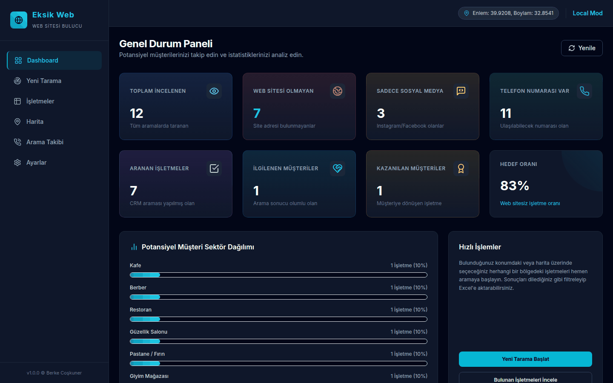
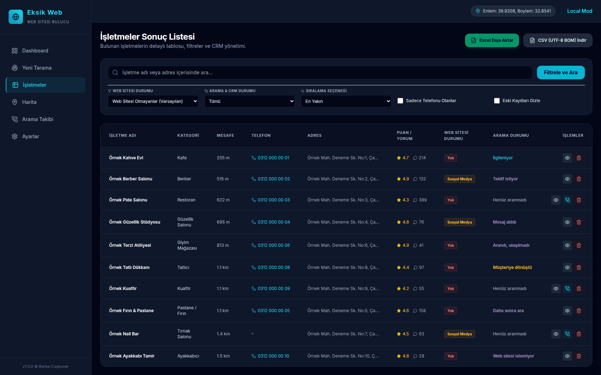
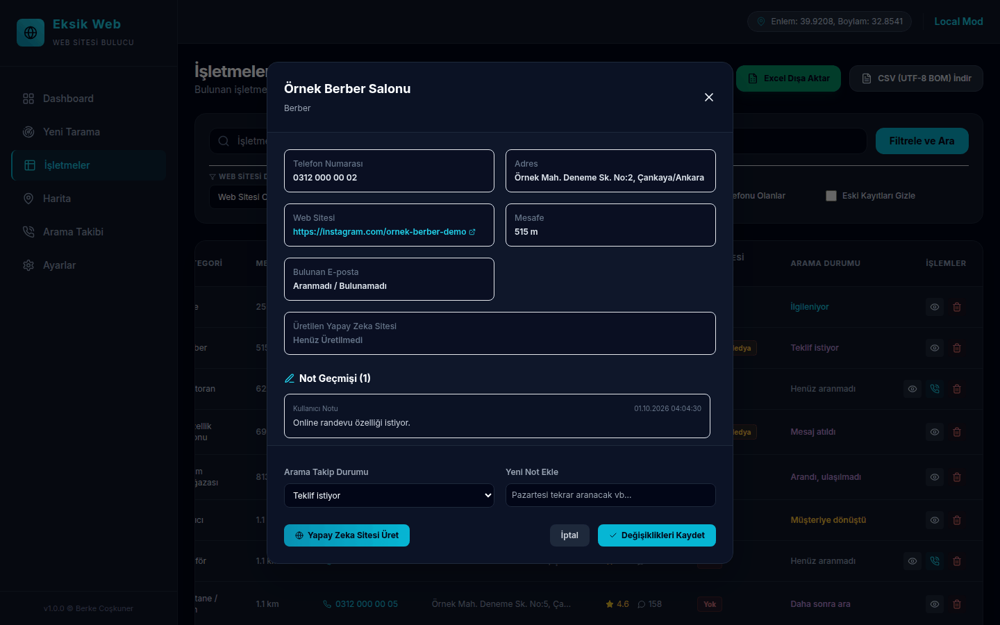
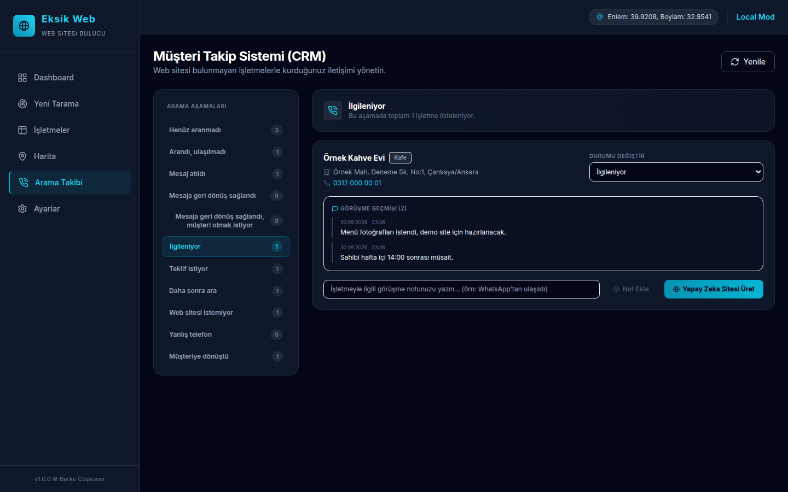
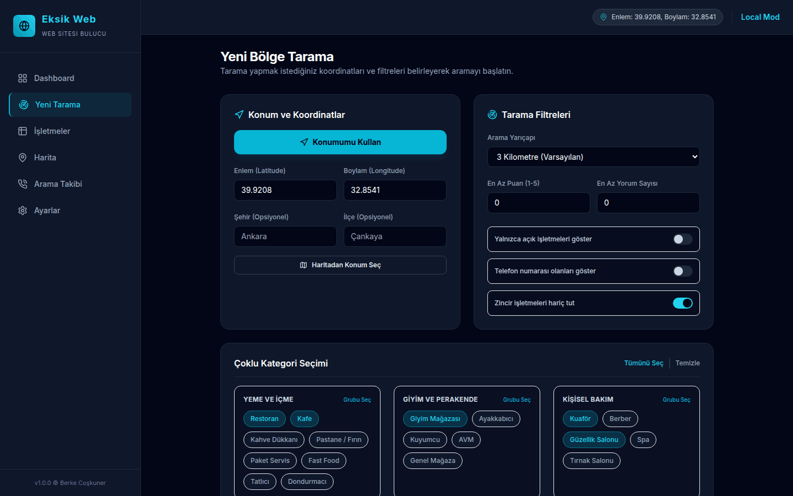
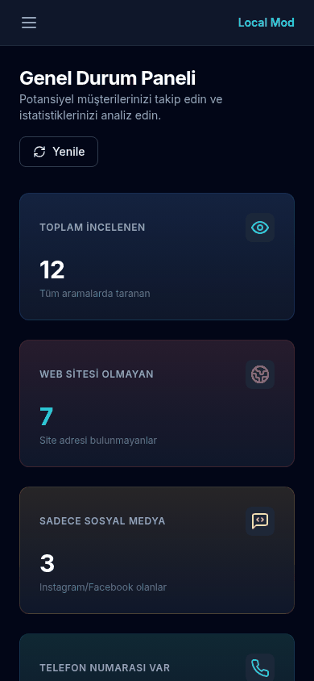
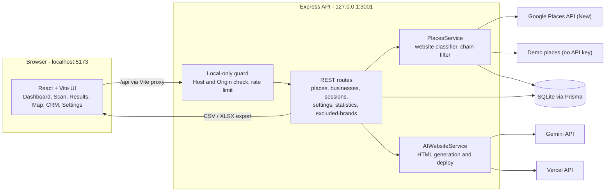
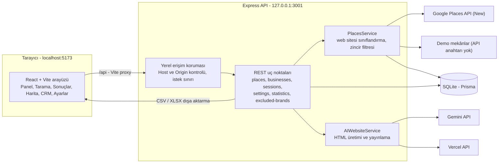

# Eksik Web — Local Business Website Finder

**A local lead-finder and CRM that scans Google Maps around a location and lists the businesses that have no website (or only a social media page), so a web designer knows whom to call.**

[](https://github.com/CoskunerBerke/maps_proje/actions/workflows/ci.yml)



<sub>All screenshots show fictional demo data created by `npm run prisma:seed-demo` (businesses named "Örnek …", invalid 0312 000 00 xx phone numbers).</sub>

> **Status:** personal tool that runs on your own computer (a Windows launcher is included). The scan / list / CRM / export flow works; the demo site generator is experimental. It has no login system and must not be exposed to a network — see [Security](#security).

## Overview

Eksik Web ("missing web") scans the area around a chosen location through the **Google Places API (New)** and classifies every business as:

- **no website**
- **social media only** (Instagram, Facebook, TikTok, X, YouTube, LinkedIn)
- **has a website**

It is built for freelancers and small agencies who sell web design / SEO services to local businesses: find the businesses that need a website, track calls and notes in a built-in CRM, and export the list.

## Features

- **Dashboard** — totals for scanned businesses, businesses without a website, called / interested / converted leads and a category breakdown
- **New scan** — pick a location (browser location, coordinates or a map click), a radius and categories from a list of 18, then run a Places Nearby Search (one request per category). A real Google search allows 10 categories by default; the limit can be raised on the Settings page
- **Results list** — filter by website status, CRM status and phone, search by name or address, sort by distance, rating or review count; export to **CSV** (UTF-8 BOM) or **Excel (.xlsx)**; remove a business with "Listeden Çıkar" (a permanent delete that also removes its notes)
- **Map view** — potential clients on an interactive Leaflet map
- **CRM tracking** — 11 call statuses, a note history per business and ready-made e-mail / WhatsApp offer templates once a demo site exists (the template texts are hard-coded in the client in the author's name)
- **Excluded brands** — chain brands (whole-word match) can be hidden so only independent businesses are listed
- **Demo mode** — works without an API key using built-in sample places (Ankara / Istanbul) with fictional phone numbers and social media handles
- **Cost limits** — the daily search limit (default 100) and the max categories per search (default 10) from the Settings page are enforced for real Google searches; failed searches count too, and two searches started at the same time cannot both slip past the daily limit
- **Demo site generator (experimental)** — for a selected business, builds a one-page website with the Gemini API from the business data and up to 4 Google photos, adds its 4–5 star Google reviews afterwards as an escaped carousel (a local template is used when Gemini is unavailable), deploys it to Vercel as a new project, looks up a public e-mail address and appends the lead to `potansiyel-musteriler.txt` on the Desktop. The Gemini key(s) and the Vercel token are entered on the Settings page.

## How it works

1. **Scan.** For every selected category the server sends one Google Places Nearby Search request (at most 5 at a time, 10 s timeout, up to 20 places each; no further pages). Because the field mask includes `websiteUri`, phone numbers, rating and opening hours, Google bills each request at its Nearby Search Enterprise tier, so cost grows with categories, not with places found. Real searches are first checked against the categories-per-search and daily limits; that check and the creation of the search record run under one lock, and the record is counted even if the search later fails.
2. **Classify.** A business is *no website* when Google returns no `websiteUri`, *social media only* when that URL's domain is one of 8 social-media domains, and *has website* otherwise. The app relies on Google's field only and does not visit the sites.
3. **Filter and store.** Chain brands (whole-word match after Turkish case and apostrophe folding), open now, phone, rating and review filters are applied, then the businesses are upserted by Google Place ID in one transaction, so call statuses, notes and demo-site links survive later scans.
4. **Work the leads.** The server filters and sorts the list; each lead has one of 11 call statuses (any status can follow any other) and a note history; CSV export neutralizes cells that a spreadsheet would run as formulas. Removing a lead deletes it and its notes, and a later scan that finds it again adds it back as a new lead.
5. **Demo site (experimental).** Gemini writes a one-page site from the business data and up to 4 Google photos; the 4–5 star reviews are added afterwards as an escaped carousel (an escaped local template is used when Gemini fails). The result is deployed to Vercel as a new project each time, and old ones are never deleted. The request runs synchronously and none of its outbound calls has a timeout. Gemini's HTML is published without review, so check it before sending it to anyone.

The full explanation, with sequence diagrams, the API reference, the data model, the exact rules and thresholds, design trade-offs and known gaps, is in **[docs/HOW_IT_WORKS.md](docs/HOW_IT_WORKS.md)**.

## Screenshots

| Results list | Lead detail and CRM update |
| --- | --- |
|  |  |
| **Call tracking (CRM)** | **New scan** |
|  |  |



<sub>Fictional demo data. The map view is not pictured.</sub>

## Architecture



A scan request creates a `SearchSession`, calls the Places API once per category (max 5 in parallel, 10 s timeout), classifies each place's `websiteUri`, applies the filters (open now, phone, rating, review count, chains) and upserts the businesses by Place ID, so call statuses and notes survive later scans. The Google API key stays in `server/.env` and is only used by the server.

## Tech stack

| Layer | Technology |
| --- | --- |
| Client | React 18, TypeScript, Vite, Tailwind CSS, React Leaflet, lucide-react |
| Server | Node.js, Express, TypeScript, Zod, SheetJS (xlsx) |
| Database | Prisma ORM + SQLite |
| External APIs | Google Places API (New), Gemini API, Vercel API |
| Tests / CI | Vitest, GitHub Actions |

## Project structure

```
maps_proje/
├── .github/workflows/ci.yml   # CI: typecheck, tests, build, migrations + seeds
├── client/                    # React + Vite front end
│   └── src/
│       ├── pages/             # Dashboard, NewScan, Businesses, MapView, CRMTracking, Settings
│       └── utils/             # safe external links
├── server/                    # Express + Prisma back end
│   ├── prisma/                # schema.prisma, migrations, seed.ts, seed-demo.ts
│   └── src/
│       ├── data/              # sample places for demo mode
│       ├── routes/            # places, businesses, sessions, settings, statistics, excluded-brands
│       ├── schemas/           # Zod request validation
│       ├── services/          # placesService, aiWebsiteService
│       ├── utils/             # classifier, list filters, brand matcher, CSV/HTML escaping, local-only guard, ...
│       └── tests/             # Vitest tests
├── docs/HOW_IT_WORKS.md       # how it works: flows, rules, data model, trade-offs
├── docs/screenshots/          # README screenshots (fictional demo data)
├── baslat.bat                 # Windows one-click launcher
└── package.json               # root scripts (runs client + server together)
```

## Getting started

Requirements: **Node.js 20+** (CI uses Node 22).

```bash
# 1. Install root, client and server dependencies
npm run install:all

# 2. Create the server environment file
cp server/.env.example server/.env        # PowerShell: Copy-Item server/.env.example server/.env

# 3. Prepare the database
npm run prisma:generate --prefix server
npm run prisma:migrate --prefix server
npm run prisma:seed --prefix server
npm run prisma:seed-demo --prefix server  # optional: 12 fictional leads to explore the UI

# 4. Start client (http://localhost:5173) and server (http://127.0.0.1:3001)
npm run dev
```

On Windows, `baslat.bat` opens the browser and runs `npm run dev`. Without `GOOGLE_MAPS_API_KEY` the app runs in demo mode.

Other scripts: `npm run build` (server `tsc` + client `vite build`), `npm start` (built server + `vite preview`), `npm test`.

## Configuration

### Environment variables (`server/.env`)

| Name | Default | Purpose |
| --- | --- | --- |
| `GOOGLE_MAPS_API_KEY` | empty | Google Places API (New) key. Empty = demo mode. |
| `PORT` | `3001` | API port (the Vite proxy in `client/vite.config.ts` points to 3001) |
| `HOST` | `127.0.0.1` | Interface the API listens on. Keep the loopback address. |
| `ALLOWED_HOSTS` | empty | Extra host names accepted in `Host` / `Origin` headers, comma separated |
| `DATABASE_URL` | none, required (`.env.example`: `file:./dev.db`) | SQLite connection string. Prisma resolves the relative path against `server/prisma/`, so the file is `server/prisma/dev.db` |
| `NODE_ENV` | unset | `production` makes the API serve the built client on its own port. `development` turns on Prisma query logs only when set in the shell environment, not in `server/.env` (the Prisma client is created before `.env` is loaded) |

The full configuration reference, including the values fixed in code, is in [docs/HOW_IT_WORKS.md](docs/HOW_IT_WORKS.md#23-configuration-reference).

### Settings page

Demo mode, the Gemini API key(s) (several keys separated by commas are tried in turn), the Vercel access token, the chain brand list and the limits. "Daily max searches" and "max categories per search" are enforced for real Google searches; "max businesses per search" is stored but not applied yet.

### Google Cloud setup (short)

1. Create a project in Google Cloud Console and attach a billing account.
2. Enable **Places API (New)**.
3. Create an API key and **restrict it to the Places API**.
4. Set budget alerts and daily quotas to avoid unexpected costs.

## Testing

```bash
npm test          # runs the server test suite (Vitest)
```

50 tests in 10 files cover the website classifier, distance math, Places search filtering (with Prisma and the Places API mocked), list filters, chain-brand matching (including the ’ apostrophe), search cost limits (including two searches started at once and failed searches), API error responses (including malformed JSON bodies), the local-only Host/Origin guard, HTML escaping in generated demo sites, CSV formula neutralization and the fictional demo-mode data. No API key or network access is needed. The live Google, Gemini and Vercel integrations are not covered by automated tests.

GitHub Actions (`.github/workflows/ci.yml`) runs on every push and pull request: server `tsc --noEmit`, tests and build, migrations and both seed scripts on a throwaway database, and the client production build.

## Deployment

Eksik Web is meant to run on your own computer:

```bash
npm run build
npm start         # API on 127.0.0.1:3001, built client on http://localhost:5173
```

With `NODE_ENV=production` the API also serves `client/dist` itself on port 3001. Do **not** deploy it to a public server or forward the port on your router: there is no authentication and the API returns the stored Gemini key and Vercel token to the UI.

## Security

- The API listens on `127.0.0.1` only and rejects requests whose `Host` header is not a local name (DNS rebinding) or whose `Origin` header carries a host name that is not local (CSRF). CORS stops cross-site `PATCH`, `DELETE` and JSON `POST` requests at the preflight, but a *simple* request such as a bodiless `POST` to the demo-site route is sent without one; the `Origin` check is what rejects it. That check ignores the port, so a page on another `localhost` port can still send simple requests.
- The Google API key is read from `server/.env` and never sent to the browser. The Gemini key(s) and the Vercel token are stored in plain text in the local SQLite database.
- Business names, addresses and reviews come from third parties: the local fallback template and the reviews carousel of a generated demo site escape them (Gemini's own HTML is not sanitized, see the last point), external links in the UI only allow `http(s)` URLs, and CSV cells starting with `=`, `+`, `-`, `@`, a tab or a carriage return get a leading `'` so spreadsheets do not run them as formulas. Phone-like values (only digits, spaces, parentheses and hyphens, optionally after a leading `+`, e.g. `+90 312 000 00 01`) are deliberately left as they are.
- Request bodies are validated with Zod. A malformed JSON body gets a 400 and an error that no route handled gets a generic 500, both as short JSON messages without a stack trace; database error details are only logged on the server. Other error messages, such as those from the Google, Gemini and Vercel APIs, are passed on so you can see why a call failed.
- HTML written by the Gemini API is published as-is — review a generated site before sending it to a business.

## Status and roadmap

- **Working:** real and demo scans, website classification, results list with filters and sorting, CSV/XLSX export, map view, CRM statuses and notes, excluded brands, dashboard statistics.
- **Experimental:** demo site generator (needs your own Gemini and Vercel accounts).
- **Known gaps:** "max businesses per search" is not enforced; the seeded chain list contains ordinary words (`Mavi`, `Gratis`) that also hide independent businesses; search history (`/api/sessions`) has no screen; regenerated demo sites pile up on Vercel; demo-site generation has no timeouts, no cancellation and no guard against two runs for the same business; the client `npm run lint` script has no ESLint configuration yet; the map needs internet access to OpenStreetMap tiles.

## Troubleshooting (Windows)

- **Execution policy error:** `Set-ExecutionPolicy -ExecutionPolicy RemoteSigned -Scope CurrentUser`
- **Port 3001/5173 already in use:** stop the process that owns the port, then run `npm run dev` again.
- **SQLite/Prisma lock:** delete `server/prisma/dev.db` and re-run the migrate and seed commands.
- **403 "Bu sunucu yalnızca yerel erişim içindir":** open the app through `http://localhost:5173`; to use another host name, add it to `ALLOWED_HOSTS`.

---

## Türkçe

**Eksik Web**, seçilen konum çevresindeki işletmeleri Google Haritalar üzerinden tarayıp **web sitesi olmayan** veya **yalnızca sosyal medya hesabı olan** işletmeleri listeleyen yerel bir potansiyel müşteri (lead) bulma ve CRM aracıdır; böylece web tasarımcısı kimi araması gerektiğini bilir.

<sub>Ekran görüntülerindeki tüm veriler `npm run prisma:seed-demo` ile oluşturulan kurgusal demo verileridir ("Örnek …" adlı işletmeler, geçersiz 0312 000 00 xx numaraları).</sub>

> **Durum:** Kendi bilgisayarınızda çalışan kişisel bir araç (Windows için başlatma dosyası mevcut). Tarama / liste / CRM / dışa aktarma akışı çalışıyor; demo site oluşturucu deneysel. Giriş (login) sistemi yoktur ve ağa açılmamalıdır — bkz. [Güvenlik](#güvenlik).

### Ne işe yarar?

Yerel işletmelere web tasarım ve SEO hizmeti satan serbest çalışanlar ve küçük ajanslar için tasarlandı. Seçilen konum çevresindeki işletmeler **Google Places API (New)** ile taranır ve her işletme "web sitesi yok", "sadece sosyal medya" (Instagram, Facebook, TikTok, X, YouTube, LinkedIn) veya "web sitesi var" olarak sınıflandırılır.

### Özellikler

- **Genel Durum Paneli** — taranan işletme, web sitesi olmayan, aranan / ilgilenen / müşteriye dönüşen sayıları ve kategori dağılımı
- **Yeni Bölge Tarama** — konum (tarayıcı konumu, koordinat veya haritadan seçim), yarıçap ve 18 kategorilik listeden seçim yaparak Places Nearby Search (kategori başına bir istek). Gerçek Google taramasında varsayılan sınır tarama başına 10 kategoridir; Ayarlar sayfasından artırılabilir
- **İşletmeler Sonuç Listesi** — web sitesi, CRM durumu ve telefona göre filtreleme, ad/adres araması, mesafe/puan/yorum sayısına göre sıralama; **CSV** (UTF-8 BOM) ve **Excel (.xlsx)** dışa aktarma; "Listeden Çıkar" ile işletmeyi silme (notlarıyla birlikte kalıcı silme)
- **Harita Görünümü** — potansiyel müşterilerin Leaflet haritası üzerinde gösterimi
- **Müşteri Takip Sistemi (CRM)** — 11 arama durumu, işletme başına not geçmişi, demo site üretildikten sonra hazır e-posta / WhatsApp teklif şablonları (şablon metinleri yazarın adıyla istemci koduna sabit yazılmıştır)
- **Hariç tutulan markalar** — zincir markalar (tam kelime eşleşmesiyle) gizlenebilir
- **Demo Modu** — API anahtarı olmadan, kurgusal telefon numaraları ve sosyal medya hesapları olan yerleşik örnek mekânlarla (Ankara / İstanbul) çalışır
- **Maliyet limitleri** — Ayarlar sayfasındaki günlük tarama limiti (varsayılan 100) ve tarama başına kategori limiti (varsayılan 10) gerçek Google taramalarında uygulanır; başarısız taramalar da sayılır ve aynı anda başlatılan iki tarama günlük limiti birlikte aşamaz
- **Demo site oluşturucu (deneysel)** — seçilen işletme için Gemini API ile işletme bilgilerinden ve en fazla 4 Google fotoğrafından tek sayfalık site üretir (Gemini kullanılamazsa yerel şablonla), 4–5 yıldızlı Google yorumlarını sonradan kaçışlı bir carousel olarak ekler, siteyi Vercel'e yeni bir proje olarak yükler, herkese açık bir e-posta adresi arar ve kaydı Masaüstündeki `potansiyel-musteriler.txt` dosyasına ekler. Gemini anahtar(lar)ı ve Vercel token'ı Ayarlar sayfasından girilir.

### Nasıl çalışır?

1. **Tarama.** Seçilen her kategori için sunucu Google Places'a bir Nearby Search isteği gönderir (aynı anda en fazla 5, 10 sn zaman aşımı, istek başına en fazla 20 işletme; sonraki sayfalar alınmaz). Alan maskesinde `websiteUri`, telefon numaraları, puan ve çalışma saatleri olduğu için Google her isteği Nearby Search Enterprise seviyesinden ücretlendirir; maliyet bulunan işletme sayısıyla değil, kategori sayısıyla artar. Gerçek taramalar önce tarama başına kategori ve günlük tarama limitlerine göre kontrol edilir; bu kontrol ve tarama kaydının oluşturulması tek bir kilit altında çalışır ve tarama sonradan başarısız olsa da kayıt sayılır.
2. **Sınıflandırma.** Google `websiteUri` döndürmezse işletme *web sitesi yok*, adresin alan adı 8 sosyal medya alan adından biriyse *sadece sosyal medya*, aksi halde *web sitesi var* sayılır. Uygulama yalnızca Google'ın bu alanına bakar, siteleri ziyaret etmez.
3. **Filtreleme ve kayıt.** Zincir markalar (Türkçe harf ve kesme işareti farkları giderildikten sonra tam kelime eşleşmesiyle), açık olma, telefon, puan ve yorum filtreleri uygulanır; işletmeler tek bir transaction içinde Google Place ID ile güncellenir, böylece arama durumları, notlar ve demo site bağlantıları sonraki taramalarda korunur.
4. **Müşteri takibi.** Liste sunucuda filtrelenir ve sıralanır; her işletmenin 11 arama durumundan biri (her durumdan her duruma geçilebilir) ve bir not geçmişi vardır; CSV dışa aktarma, tablo programlarının formül olarak çalıştıracağı hücreleri etkisiz hale getirir. Bir işletmeyi listeden çıkarmak onu notlarıyla birlikte siler; sonraki bir tarama onu bulursa yeni bir kayıt olarak geri ekler.
5. **Demo site (deneysel).** Gemini, işletme bilgileri ve en fazla 4 Google fotoğrafından tek sayfalık bir site yazar; 4–5 yıldızlı yorumlar sonradan kaçışlı bir carousel olarak eklenir (Gemini başarısız olursa kaçışlı yerel şablon kullanılır). Sonuç her seferinde yeni bir proje olarak Vercel'e yüklenir ve eski projeler silinmez. İstek eşzamanlı çalışır ve dış çağrılarının hiçbirinde zaman aşımı yoktur. Gemini'nin HTML'i kontrol edilmeden yayınlanır; kimseye göndermeden önce inceleyin.

Diyagramlar, API listesi, veri modeli, kesin kurallar ve eşik değerleri, tasarım tercihleri ve bilinen eksiklerle ayrıntılı açıklama (İngilizce, sonunda Türkçe özetiyle): **[docs/HOW_IT_WORKS.md](docs/HOW_IT_WORKS.md)**.

### Ekran görüntüleri

| Sonuç listesi | İşletme detayı ve CRM güncelleme |
| --- | --- |
|  |  |
| **Arama takibi (CRM)** | **Yeni tarama** |
|  |  |


<sub>Kurgusal demo verisi. Harita görünümü gösterilmemiştir.</sub>

### Mimari



Bir tarama isteği bir `SearchSession` oluşturur, her kategori için Places API'yi bir kez çağırır (en fazla 5 paralel, 10 sn zaman aşımı), `websiteUri` alanını sınıflandırır, filtreleri (açık olanlar, telefon, puan, yorum sayısı, zincirler) uygular ve işletmeleri Place ID ile günceller; böylece arama durumları ve notlar sonraki taramalarda korunur. Google API anahtarı `server/.env` dosyasında kalır ve yalnızca sunucu tarafından kullanılır.

### Teknolojiler

| Katman | Teknoloji |
| --- | --- |
| İstemci | React 18, TypeScript, Vite, Tailwind CSS, React Leaflet, lucide-react |
| Sunucu | Node.js, Express, TypeScript, Zod, SheetJS (xlsx) |
| Veritabanı | Prisma ORM + SQLite |
| Harici API'ler | Google Places API (New), Gemini API, Vercel API |
| Test / CI | Vitest, GitHub Actions |

### Proje yapısı

```
maps_proje/
├── .github/workflows/ci.yml   # CI: tip kontrolü, testler, build, migration + seed
├── client/                    # React + Vite arayüzü
│   └── src/
│       ├── pages/             # Dashboard, NewScan, Businesses, MapView, CRMTracking, Settings
│       └── utils/             # güvenli dış bağlantılar
├── server/                    # Express + Prisma sunucusu
│   ├── prisma/                # schema.prisma, migration'lar, seed.ts, seed-demo.ts
│   └── src/
│       ├── data/              # demo modu örnek mekânları
│       ├── routes/            # places, businesses, sessions, settings, statistics, excluded-brands
│       ├── schemas/           # Zod istek doğrulama
│       ├── services/          # placesService, aiWebsiteService
│       ├── utils/             # sınıflandırıcı, liste filtreleri, marka eşleştirme, CSV/HTML kaçışı, yerel erişim koruması, ...
│       └── tests/             # Vitest testleri
├── docs/HOW_IT_WORKS.md       # nasıl çalışır: akışlar, kurallar, veri modeli, tercihler
├── docs/screenshots/          # README görüntüleri (kurgusal demo verisi)
├── baslat.bat                 # Windows tek tıkla başlatıcı
└── package.json               # kök komutlar (istemci + sunucuyu birlikte çalıştırır)
```

### Kurulum

Gereksinim: **Node.js 20+** (CI Node 22 kullanır).

```bash
npm run install:all
cp server/.env.example server/.env        # PowerShell: Copy-Item server/.env.example server/.env
npm run prisma:generate --prefix server
npm run prisma:migrate --prefix server
npm run prisma:seed --prefix server
npm run prisma:seed-demo --prefix server  # isteğe bağlı: arayüzü denemek için 12 kurgusal işletme
npm run dev
```

Uygulama `http://localhost:5173` adresinde açılır; API `127.0.0.1:3001` adresinde çalışır. Windows'ta `baslat.bat` tarayıcıyı açıp `npm run dev` komutunu çalıştırır. `GOOGLE_MAPS_API_KEY` girilmezse uygulama demo modunda çalışır.

Diğer komutlar: `npm run build` (sunucu `tsc` + istemci `vite build`), `npm start` (derlenmiş sunucu + `vite preview`), `npm test`.

### Yapılandırma

**Ortam değişkenleri (`server/.env`):**

| Ad | Varsayılan | Açıklama |
| --- | --- | --- |
| `GOOGLE_MAPS_API_KEY` | boş | Google Places API (New) anahtarı. Boşsa demo modu. |
| `PORT` | `3001` | API portu (`client/vite.config.ts` içindeki proxy 3001'e yönlenir) |
| `HOST` | `127.0.0.1` | API'nin dinlediği arayüz. Loopback adresinde bırakın. |
| `ALLOWED_HOSTS` | boş | `Host` / `Origin` başlıklarında kabul edilecek ek host adları (virgülle) |
| `DATABASE_URL` | yok, zorunlu (`.env.example`: `file:./dev.db`) | SQLite bağlantı adresi. Prisma göreli yolu `server/prisma/` klasörüne göre çözer; dosya `server/prisma/dev.db` olur |
| `NODE_ENV` | tanımsız | `production` ile API derlenmiş arayüzü kendi portundan sunar. `development` Prisma sorgu loglarını yalnızca kabuk ortamında tanımlıysa açar, `server/.env` içinde açmaz (Prisma istemcisi `.env` yüklenmeden oluşturulur) |

Koda sabit yazılmış değerler dahil tüm yapılandırma listesi: [docs/HOW_IT_WORKS.md](docs/HOW_IT_WORKS.md#23-configuration-reference).

**Ayarlar sayfası:** demo modu, Gemini API anahtar(lar)ı (virgülle ayrılan anahtarlar sırayla denenir), Vercel token'ı, zincir marka listesi ve limitler. "Günlük maksimum tarama" ve "tarama başına maksimum kategori" gerçek Google taramalarında uygulanır; "tarama başına maksimum işletme" kaydedilir ama henüz uygulanmaz.

**Google Cloud:** Proje oluşturun, faturalandırma hesabı bağlayın, **Places API (New)**'yi etkinleştirin, API anahtarı oluşturup yalnızca Places API ile sınırlandırın ve bütçe uyarısı / günlük kota belirleyin.

### Testler

```bash
npm test          # sunucu test paketini (Vitest) çalıştırır
```

10 dosyadaki 50 test; web sitesi sınıflandırıcıyı, mesafe hesabını, Places arama filtrelerini (Prisma ve Places API mock'lanmış), liste filtrelerini, zincir marka eşleştirmeyi (’ kesme işareti dahil), tarama limitlerini (aynı anda başlatılan ve başarısız taramalar dahil), API hata yanıtlarını (bozuk JSON gövdeleri dahil), yerel erişim korumasını, üretilen sitelerdeki HTML kaçışını, CSV formül korumasını ve demo modunun kurgusal verisini kapsar. API anahtarı veya ağ erişimi gerekmez; canlı Google, Gemini ve Vercel entegrasyonları otomatik testlerle kapsanmaz.

GitHub Actions (`.github/workflows/ci.yml`) her push ve pull request'te sunucu için `tsc --noEmit`, testler ve build, geçici bir veritabanında migration'lar ve iki seed betiği ile istemcinin production build'ini çalıştırır.

### Dağıtım

Eksik Web kendi bilgisayarınızda çalışmak üzere tasarlanmıştır:

```bash
npm run build
npm start         # API 127.0.0.1:3001, derlenmiş arayüz http://localhost:5173
```

`NODE_ENV=production` ile API, `client/dist` klasörünü de 3001 portundan sunar. Uygulamayı herkese açık bir sunucuya **kurmayın** ve portu modeminizden dışarı açmayın: kimlik doğrulama yoktur ve API kayıtlı Gemini anahtarını ve Vercel token'ını arayüze döndürür.

### Güvenlik

- API yalnızca `127.0.0.1` adresini dinler; `Host` başlığı yerel bir ad olmayan (DNS rebinding) veya `Origin` başlığındaki host adı yerel olmayan (CSRF) istekleri reddeder. CORS, siteler arası `PATCH`, `DELETE` ve JSON `POST` isteklerini ön kontrolde (preflight) durdurur; ancak demo site uç noktasına gövdesiz bir `POST` gibi *basit* bir istek ön kontrolsüz gönderilir ve onu `Origin` kontrolü reddeder. Bu kontrol portu karşılaştırmaz; bu yüzden `localhost`'ta başka bir porttaki sayfa basit istekleri yine gönderebilir.
- Google API anahtarı `server/.env` dosyasından okunur ve tarayıcıya gönderilmez. Gemini anahtar(lar)ı ve Vercel token'ı yerel SQLite veritabanında düz metin olarak saklanır.
- İşletme adları, adresler ve yorumlar üçüncü taraflardan gelir: üretilen demo sitenin yerel yedek şablonunda ve yorum carousel'inde kaçışlanır (Gemini'nin kendi HTML'i temizlenmez, bkz. son madde), arayüzdeki dış bağlantılarda yalnızca `http(s)` adreslerine izin verilir ve `=`, `+`, `-`, `@`, sekme veya satır başı (CR) karakteriyle başlayan CSV hücrelerinin başına `'` eklenir; böylece tablo programları bunları formül olarak çalıştırmaz. Telefon numarasına benzeyen değerler (yalnızca rakam, boşluk, parantez ve tire; başta isteğe bağlı `+`, örn. `+90 312 000 00 01`) bilerek olduğu gibi bırakılır.
- İstek gövdeleri Zod ile doğrulanır. Bozuk bir JSON gövdesi 400, hiçbir route'un yakalamadığı bir hata genel bir 500 yanıtı alır; ikisi de yığın izi (stack trace) içermeyen kısa JSON mesajlarıdır. Veritabanı hata ayrıntıları yalnızca sunucuda loglanır. Google, Gemini ve Vercel API'lerininki gibi diğer hata mesajları, çağrının neden başarısız olduğu görülebilsin diye iletilir.
- Gemini API'nin yazdığı HTML olduğu gibi yayınlanır — üretilen siteyi işletmeye göndermeden önce kontrol edin.

### Durum ve yol haritası

- **Çalışan:** gerçek ve demo tarama, web sitesi sınıflandırma, filtreli ve sıralı sonuç listesi, CSV/XLSX dışa aktarma, harita, CRM durumları ve notlar, hariç tutulan markalar, panel istatistikleri.
- **Deneysel:** demo site oluşturucu (kendi Gemini ve Vercel hesaplarınızı gerektirir).
- **Bilinen eksikler:** "tarama başına maksimum işletme" uygulanmıyor; varsayılan zincir listesindeki sıradan kelimeler (`Mavi`, `Gratis`) bağımsız işletmeleri de gizliyor; tarama geçmişinin (`/api/sessions`) ekranı yok; yeniden üretilen demo siteler Vercel'de birikiyor; demo site üretiminde zaman aşımı, iptal ve aynı işletme için iki üretimi engelleyen bir kilit yok; istemcideki `npm run lint` için henüz ESLint yapılandırması yok; harita OpenStreetMap karolarına internet erişimi gerektirir.

### Sorun giderme (Windows)

- **Execution policy hatası:** `Set-ExecutionPolicy -ExecutionPolicy RemoteSigned -Scope CurrentUser`
- **3001/5173 portu kullanımda:** portu kullanan işlemi durdurup `npm run dev` komutunu tekrar çalıştırın.
- **SQLite/Prisma kilidi:** `server/prisma/dev.db` dosyasını silip migrate ve seed komutlarını tekrar çalıştırın.
- **403 "Bu sunucu yalnızca yerel erişim içindir":** uygulamayı `http://localhost:5173` üzerinden açın; başka bir host adı için `ALLOWED_HOSTS` değişkenine ekleyin.

---

Built by [Berke Coşkuner](https://github.com/CoskunerBerke)
