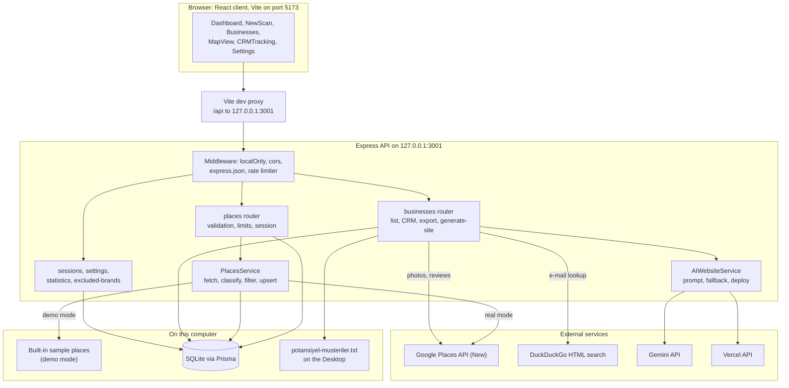
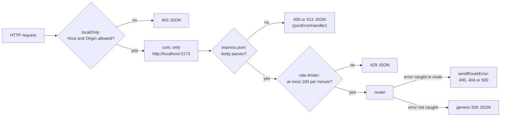
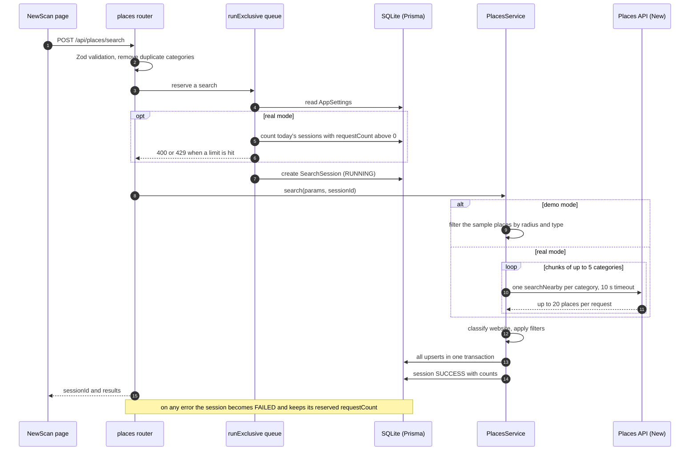
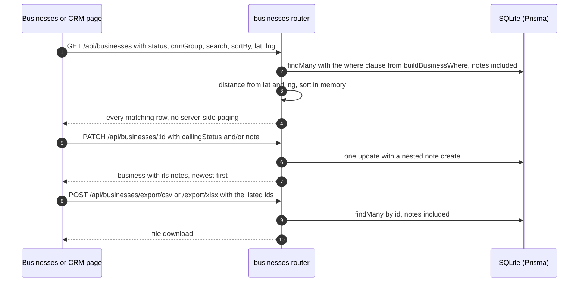
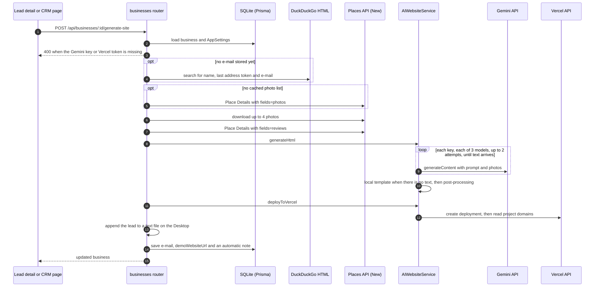
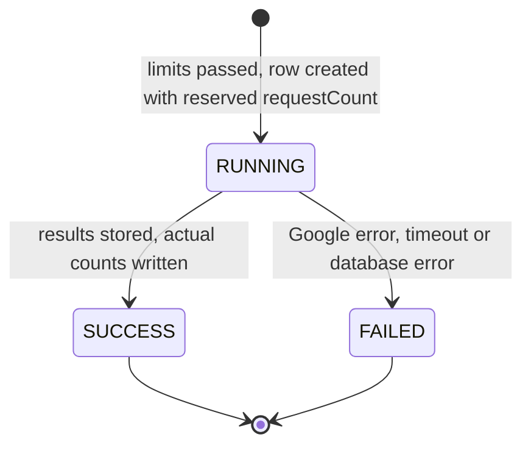
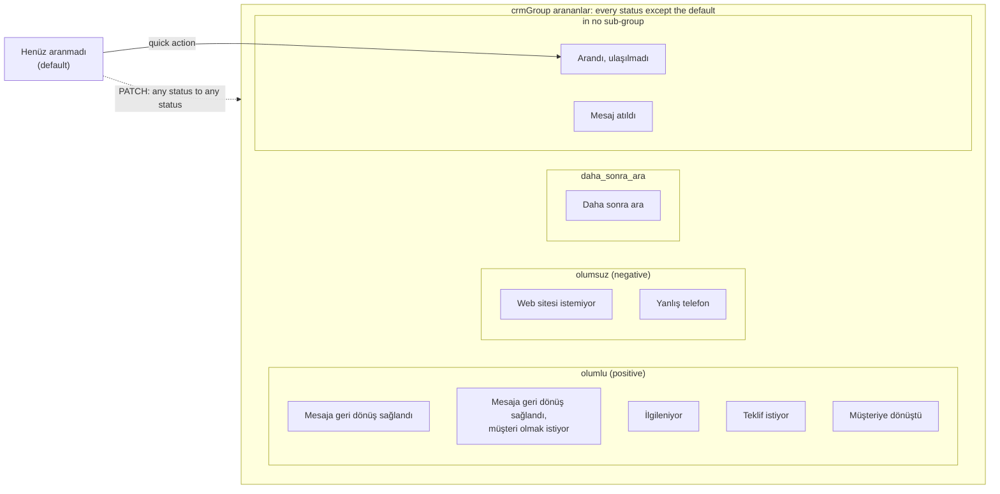

# How Eksik Web works

This document explains the engineering behind Eksik Web for a reader who has never seen the repository: what it does, how a request moves through the system, the rules that decide which businesses become leads, and why the code is built the way it is. Every number below comes from the code or from a test run; links point to the file and the symbol that implements each rule.

The user interface and the stored labels are in Turkish. Turkish terms are explained where they first appear and again in the [glossary](#10-glossary). A Turkish summary is at the end ([Türkçe özet](#türkçe-özet)).

## Contents

1. [What it is and what it is not](#1-what-it-is-and-what-it-is-not)
2. [Architecture](#2-architecture)
3. [Main runtime flows](#3-main-runtime-flows)
4. [Data model](#4-data-model)
5. [Core logic in depth](#5-core-logic-in-depth)
6. [Design decisions and trade-offs](#6-design-decisions-and-trade-offs)
7. [Testing strategy](#7-testing-strategy)
8. [Limitations, known gaps and next steps](#8-limitations-known-gaps-and-next-steps)
9. [Code tour](#9-code-tour)
10. [Glossary](#10-glossary)

---

## 1. What it is and what it is not

**What it is.** Eksik Web ("missing web") is a single-user lead finder with a small CRM. It runs on the user's own computer. It works in five steps:

1. It asks the **Google Places API (New) Nearby Search** for businesses of chosen types inside a circle.
2. It labels every business by the `websiteUri` field Google returns: no website, social media only, or has a website.
3. It stores the businesses in SQLite, keyed by their Google Place ID, so later scans update them instead of duplicating them.
4. A web designer can then track calls, statuses and notes, filter and sort the leads, and export them to CSV or Excel.
5. As an experimental extra, it can generate a one-page demo website for a lead with the Gemini API and deploy it to Vercel.

**What it is not.**

- **Not a hosted, multi-user service.** It has no accounts and no authentication. It is designed to listen on `127.0.0.1` only (see [5.13](#513-local-only-security-model)).
- **Not a web crawler.** The "no website" decision uses only the `websiteUri` field from Google. The app never visits a business's site and never searches the web to check it (see [5.2](#52-deciding-that-a-business-has-no-website)). The only web search in the code is the e-mail lookup in the demo-site flow.
- **Not an enforced sales pipeline.** The 11 call statuses are labels. The API accepts a change from any status to any other (see [5.8](#58-crm-call-tracking-statuses-groups-and-transitions)).
- **Not exhaustive coverage of an area.** Each category returns at most 20 places per scan (see [5.1](#51-the-search-pipeline-categories-fan-out-and-result-limits)).

**Honest status.**

- The scan, list, CRM and export flow works. The server test suite covers it with the database and the Places API mocked: 50 tests in 10 files, all passing (see [7](#7-testing-strategy)).
- The demo-site generator is experimental. Its Gemini, Vercel, Place Details and DuckDuckGo calls have no automated tests.
- One setting on the Settings page, "max businesses per search", is stored but never applied.

## 2. Architecture



The diagram shows the development setup. The other ways to run it are in [2.1](#21-run-modes).

| Component | Responsibility | Code |
| --- | --- | --- |
| React client | A single page app that switches tabs through state, with no router. It also remembers the last location in `localStorage`. The results list is paged on the client, 10 rows per page. | [`App.tsx` `App`](../client/src/App.tsx), [`pages/`](../client/src/pages) |
| Vite dev proxy | Forwards `/api` to `http://127.0.0.1:3001` with `changeOrigin: true`, so the API sees a loopback `Host` header. | [`vite.config.ts`](../client/vite.config.ts) |
| Server entry | Loads `.env`, builds the app and listens on `HOST` (default `127.0.0.1`) and `PORT` (default `3001`). | [`server.ts`](../server/src/server.ts) |
| App factory | Builds the middleware chain, mounts six routers and adds the final JSON error handler. It is a factory so the tests can drive the real stack. | [`app.ts` `createApp`](../server/src/app.ts) |
| `places` router | Validates a scan, enforces the cost limits under a lock, and creates and finishes the `SearchSession`. | [`routes/places.ts`](../server/src/routes/places.ts) |
| `PlacesService` | Runs the Google or demo search, classifies websites, applies the filters and upserts the businesses. | [`placesService.ts` `PlacesService.search`](../server/src/services/placesService.ts) |
| `businesses` router | Lists, filters and sorts businesses, updates CRM statuses and notes, exports, and runs the demo-site flow. | [`routes/businesses.ts`](../server/src/routes/businesses.ts) |
| `AIWebsiteService` | Builds the prompt, calls Gemini with retries, falls back to a local template, post-processes the HTML and deploys it to Vercel. | [`aiWebsiteService.ts`](../server/src/services/aiWebsiteService.ts) |
| Other routers | Search history, settings, dashboard counters and the chain-brand list. | [`sessions.ts`](../server/src/routes/sessions.ts), [`settings.ts`](../server/src/routes/settings.ts), [`statistics.ts`](../server/src/routes/statistics.ts), [`excludedBrands.ts`](../server/src/routes/excludedBrands.ts) |
| Pure helpers | The business rules, kept free of I/O so they can be unit-tested. | [`server/src/utils/`](../server/src/utils) |
| Persistence | Prisma ORM on a SQLite file. | [`schema.prisma`](../server/prisma/schema.prisma) |

Every request passes through the same middleware chain, in this order ([`app.ts` `createApp`](../server/src/app.ts)):



### 2.1 Run modes

| Mode | How it starts | Who serves the page | Page origin (sent as `Origin` when the browser adds one) |
| --- | --- | --- | --- |
| Development | `npm run dev`: `ts-node-dev` for the server, `vite` for the client | The Vite dev server on `localhost:5173`. It proxies `/api` to `127.0.0.1:3001`. | `http://localhost:5173` |
| Preview | `npm start`: `node dist/server.js` and `vite preview --port 5173` | The Vite preview server on port 5173. Vite's preview server inherits the dev `proxy` setting, so `/api` is forwarded the same way. | `http://localhost:5173` |
| Production | `NODE_ENV=production` in the server's environment or `server/.env`. No script sets it. | The API itself. [`createApp`](../server/src/app.ts) adds `express.static` for `client/dist` and a `GET *` fallback to `index.html`, so page and API share port 3001. | `http://localhost:3001` or `http://127.0.0.1:3001` |

In production mode the page and the API have the same origin, so CORS plays no part. The Origin guard still runs and passes, because it checks only the hostname ([5.13](#513-local-only-security-model)). The static files and the fallback are mounted after the guard and the rate limiter, so page loads count toward the same 100 requests per minute. The fallback is registered after the routers, so an unknown `GET /api/...` path returns `index.html` with status 200 instead of a 404.

### 2.2 API reference

Every API route is under `/api`, has no authentication and passes through the middleware chain above. Bodies and responses are JSON, except the two exports and the production-only fallback in the last row. The last column names the client page that calls the route.

| Method and path | Input | Effect and response | Called from |
| --- | --- | --- | --- |
| `POST /api/places/search` | Body ([`SearchRequestSchema`](../server/src/schemas/validation.ts)): `latitude`, `longitude`, `radius`, `categories`, `onlyOpen`, `onlyWithPhone`, `minimumRating`, `minimumReviewCount`, `excludeChains` | Reserves a `SearchSession` under the lock, runs the scan and upserts the businesses ([3.1](#31-scanning-an-area)). Returns `{ sessionId, results }`. 400 for invalid input, too many categories or a whitespace-only key, 429 for the daily limit. | NewScan |
| `GET /api/businesses` | Query: `status`, `callingStatus`, `crmGroup`, `onlyWithPhone`, `search`, `excludeExisting`, `sortBy`, `lat`, `lng` | Every matching business with its notes and a `distance` in metres (0 without coordinates). No paging ([5.10](#510-listing-filtering-and-sorting)). | Businesses, CRMTracking, MapView |
| `GET /api/businesses/:id` | none | One business with its notes, or 404. | Not called by the client |
| `PATCH /api/businesses/:id` | Body ([`BusinessUpdateSchema`](../server/src/schemas/validation.ts)): `callingStatus` (one of 11, optional), `note` (up to 5000 characters, optional) | One update with an optional nested note ([5.9](#59-notes)). Returns the business with its notes, or 404. | Businesses (row action and lead detail), CRMTracking |
| `DELETE /api/businesses/:id` | none | **Permanently deletes** the business. Its notes go with it by cascade ([5.5](#55-deduplication-and-persistence-across-scans)). | Businesses: the "Listeden Çıkar" button |
| `POST /api/businesses/export/csv` | Body ([`ExportRequestSchema`](../server/src/schemas/validation.ts)): `businessIds` (up to 10,000, optional), `lat`, `lng` | A CSV download ([5.11](#511-csv-and-xlsx-export-with-formula-neutralization)). **Without `businessIds`, every business in the database is exported.** | Businesses |
| `POST /api/businesses/export/xlsx` | Same as CSV | An XLSX download. `lat` and `lng` fill the distance column. | Businesses |
| `POST /api/businesses/:id/generate-site` | none | The demo-site flow ([5.12](#512-demo-site-generation)). It calls DuckDuckGo, Google, Gemini and Vercel, creates a new Vercel project, and writes `email`, `demoWebsiteUrl`, a note and a line in the Desktop file. | Businesses (lead detail), CRMTracking |
| `GET /api/sessions` | none | Every `SearchSession`, newest first. | **No client UI** |
| `GET /api/sessions/:id` | none | One session with the businesses it first found, or 404. | **No client UI** |
| `DELETE /api/sessions/:id` | none | Deletes the session. Its businesses stay, with `searchSessionId` set to `NULL`. The session stops counting toward today's limit ([5.6](#56-cost-limits-and-the-serial-queue)). | **No client UI** |
| `GET /api/excluded-brands` | none | The brand list, sorted by name. | Settings |
| `POST /api/excluded-brands` | Body: `name` (trimmed, 1 to 100 characters) | Adds a brand and returns 201. Returns 400 if exactly that name is already stored. | Settings |
| `DELETE /api/excluded-brands/:id` | none | Removes a brand, or 404. | Settings |
| `GET /api/settings` | none | The `global` settings row, created with defaults if it is missing. **The response contains `geminiApiKey` and `vercelToken` in plain text.** | Settings |
| `PATCH /api/settings` | Body ([`SettingsUpdateSchema`](../server/src/schemas/validation.ts)): any of `dailyMaxSearches` (1 to 1000), `maxCategoriesPerSearch` (1 to 50), `maxBusinessesPerSearch` (1 to 1000), `isDemoMode`, `geminiApiKey`, `vercelToken` | Upserts the settings row and returns it. | Settings |
| `GET /api/statistics` | none | Totals (all, per website status, with a phone, called, interested, converted) and the category breakdown of potential clients. | Dashboard |
| `GET *` (production mode only) | none | A file from `client/dist`, otherwise `index.html`. | The browser |

The routes with the largest effect are `GET /api/settings`, which returns the stored credentials; the two business and session `DELETE` routes, which cannot be undone; an export without `businessIds`, which returns the whole database; and `generate-site`, which spends Google, Gemini and Vercel quota and publishes a page. The search-history routes exist only as API: the client has no screen that lists or deletes sessions.

## 3. Main runtime flows

### 3.1 Scanning an area

The NewScan page sends `POST /api/places/search`. The route reserves the search under a lock, then hands it to `PlacesService`.



The progress steps on the NewScan page ("scanning", "checking details", "filtering") run on client-side timers, at 2 s and 4.5 s. They do not report server progress ([`NewScan.tsx` `handleStartScan`](../client/src/pages/NewScan.tsx)).

### 3.2 Working the leads: list, CRM update, export



The export buttons send the IDs of the rows currently listed ([`Businesses.tsx` `handleExportExcel`](../client/src/pages/Businesses.tsx)), so the export follows the active filters.

### 3.3 Generating a demo site (experimental)



The steps are explained in [5.12](#512-demo-site-generation).

## 4. Data model

The schema is in [`schema.prisma`](../server/prisma/schema.prisma), with three migrations in [`server/prisma/migrations`](../server/prisma/migrations).

```mermaid
erDiagram
    SearchSession ||--o{ Business : "first found in"
    Business ||--o{ BusinessNote : "has"
    SearchSession {
        string id PK "uuid"
        datetime createdAt
        float latitude
        float longitude
        float radius "meters"
        string categories "JSON array"
        int totalFound
        int noWebsiteCount
        int requestCount "billed requests"
        string status "RUNNING, SUCCESS, FAILED"
        string errorMessage
    }
    Business {
        string id PK "Google Place ID"
        string name
        string primaryType
        string types "JSON array"
        string websiteUri
        string websiteStatus
        string callingStatus "default Henüz aranmadı"
        string searchSessionId FK
        datetime lastSeenAt
        string demoWebsiteUrl
        string email
        string photos "JSON array"
    }
    BusinessNote {
        string id PK "uuid"
        string businessId FK
        string content
        datetime createdAt
    }
    AppSettings {
        string id PK "always global"
        int dailyMaxSearches "default 100"
        int maxCategoriesPerSearch "default 10"
        int maxBusinessesPerSearch "default 100, not enforced"
        boolean isDemoMode
        string geminiApiKey
        string vercelToken
    }
    ExcludedBrand {
        string id PK "uuid"
        string name UK
    }
```



The fields that matter:

| Entity | Field | Meaning |
| --- | --- | --- |
| `Business` | `id` | The Google Place ID, used as the primary key. A natural key makes every scan an idempotent upsert ([5.5](#55-deduplication-and-persistence-across-scans)). Demo rows use `demo_place_N` (demo mode) or `demo_showcase_N` (the demo seed). |
| `Business` | `websiteStatus` | `no_website`, `social_media_only` or `has_website`, set on every scan by [`classifyWebsite`](../server/src/utils/websiteClassifier.ts). The type also allows `unchecked`, but no code path produces it. |
| `Business` | `callingStatus` | One of the 11 Turkish CRM statuses, default `Henüz aranmadı` ("not called yet"). It is a plain string in the database. Only the API checks the allowed values. |
| `Business` | `nationalPhoneNumber`, `internationalPhoneNumber` | "Has a phone" means either one is set, both in the scan filter and in the list filter. |
| `Business` | `searchSessionId` | Set when the row is created and never updated, so it points to the scan that **first** found the business. When that session is deleted (possible only through the API, see [2.2](#22-api-reference)) it becomes `NULL` (`onDelete: SetNull`). |
| `Business` | `lastSeenAt` | Updated whenever a later scan returns the business again. Nothing reads it yet. |
| `Business` | `email`, `demoWebsiteUrl`, `photos` | Written by the demo-site flow. `email` holds `Bulunamadı` ("not found") when the lookup failed. |
| `BusinessNote` | `content`, `createdAt` | A note history that is only ever added to (max 5000 characters per note). Notes are deleted only with their business (`onDelete: Cascade`), which happens when the user removes the business with "Listeden Çıkar" ([5.5](#55-deduplication-and-persistence-across-scans)). |
| `SearchSession` | `requestCount` | The number of billed Google requests. It drives the daily limit ([5.6](#56-cost-limits-and-the-serial-queue)). Demo searches store `0`. |
| `AppSettings` | `id = "global"` | A single row. `GET /api/settings` creates it with defaults if it is missing. The seed script creates it too. |
| `ExcludedBrand` | `name` | Unique. The seed script adds 11 brands ([`seed.ts` `DEFAULT_CHAIN_BRANDS`](../server/prisma/seed.ts)): Starbucks, McDonald's, Burger King, KFC, Domino's, LC Waikiki, DeFacto, Mavi, FLO, Watsons, Gratis. |

`types`, `categories` and `photos` are JSON arrays stored as text. The API never filters on them, and SQLite has no array type. The list endpoints parse `types` back into an array before responding.

## 5. Core logic in depth

### 5.1 The search pipeline: categories, fan-out and result limits

**Categories.** The client offers 18 Google place types in three groups ([`NewScan.tsx` `CATEGORY_GROUPS`](../client/src/pages/NewScan.tsx)):

- Food and drink, 8 types: `restaurant`, `cafe`, `coffee_shop`, `bakery`, `meal_takeaway`, `fast_food_restaurant`, `dessert_shop`, `ice_cream_shop`.
- Clothing and retail, 5 types: `clothing_store`, `shoe_store`, `jewelry_store`, `shopping_mall`, `store`.
- Personal care, 5 types: `hair_salon`, `barber_shop`, `beauty_salon`, `spa`, `nail_salon`.

Five are preselected. The default radius is 3000 m, and the UI offers 500 m, 1, 2, 3, 5 and 10 km.

**Validation.** [`SearchRequestSchema`](../server/src/schemas/validation.ts) checks the request body:

- latitude from -90 to 90 and longitude from -180 to 180
- radius from 50 to 50000 m
- 1 to 50 categories, each matching `^[a-z0-9_]{1,64}$`
- `minimumRating` from 0 to 5 and `minimumReviewCount` of 0 or more

The route then removes duplicate categories, because each duplicate would be one more billed request.

**Fan-out.** [`PlacesService.searchGoogle`](../server/src/services/placesService.ts) sends **one Nearby Search request per category**, each with the following settings:

- `includedTypes: [category]` and `maxResultCount: 20`.
- A `locationRestriction` circle around the chosen point.
- An `X-Goog-FieldMask` with 15 fields: id, display name, address, location, primary type, types, website, both phone numbers, rating, rating count, Maps URI, business status, opening hours and photos. The mask limits the response to these fields.
- A 10 s timeout through an `AbortController`.

The categories are processed in chunks of 5 (`chunkSize = 5`). The requests inside a chunk run in parallel and are awaited with `Promise.allSettled`. The chunks run one after another, so at most 5 requests are in flight at a time.

**What a request costs: the field mask sets the tier.** Google bills a Nearby Search (New) request at the highest pricing tier (SKU) that any field in its field mask belongs to ([Google's Nearby Search (New) documentation](https://developers.google.com/maps/documentation/places/web-service/nearby-search)). Six of the 15 fields in this mask belong to the **Nearby Search Enterprise** tier: `websiteUri`, `nationalPhoneNumber`, `internationalPhoneNumber`, `rating`, `userRatingCount` and `regularOpeningHours`. Every category request is therefore billed as an Enterprise request. Three consequences follow:

- The tier cannot be lowered without changing what the tool does. `websiteUri`, the one field the classification needs, triggers the Enterprise tier on its own. Dropping the phone, rating and opening-hours fields would shrink the response but not the price.
- The billing unit is the request, not the place. A category that returns 3 places costs the same as one that returns 20.
- That is why the cost limits in [5.6](#56-cost-limits-and-the-serial-queue) count categories and searches, not businesses.

This document gives no prices, because Google sets and changes them.

**Pagination and result limits.** The code requests 20 results and does not page further. Nearby Search (New) has no next-page token, so each category yields at most 20 places per scan. No `rankPreference` is sent, so Google's default ranking decides which 20 places come back. To cover a dense area, the user narrows the radius or the categories and scans again. The upsert keeps the earlier results.

**Partial failure fails the whole scan.** After each chunk, the first rejected request throws, carrying Google's status and response text. The remaining chunks are not sent, nothing is stored, and the route marks the session `FAILED`. Section [6](#6-design-decisions-and-trade-offs) explains why.

**Mapping and in-scan deduplication.** Each raw place is flattened. A missing name becomes `İsimsiz İşletme` ("unnamed business"), and `isOpen` comes from `regularOpeningHours.openNow`. The place is then stored in a `Map` keyed by place ID. A business returned by two categories, for example a café that is also a bakery, therefore appears once. Places without an ID or coordinates are dropped.

### 5.2 Deciding that a business has no website

[`classifyWebsite`](../server/src/utils/websiteClassifier.ts) is a pure function of the `websiteUri` string Google returns:

1. If the value is `null`, `undefined`, empty or whitespace, the result is **`no_website`**.
2. Otherwise the value is trimmed and lowercased. If it has no `://`, `http://` is prepended. The hostname is parsed with `URL`, and one leading `www.` is removed.
3. If the hostname equals, or is a subdomain of, one of 8 social domains (`instagram.com`, `facebook.com`, `fb.com`, `tiktok.com`, `x.com`, `twitter.com`, `youtube.com`, `linkedin.com`), the result is **`social_media_only`**. Subdomains such as `m.facebook.com` also count.
4. Anything else is **`has_website`**. If parsing throws, a substring check against the same domain list decides between `social_media_only` and `has_website`.

A business is a **potential client** when its status is `no_website` or `social_media_only` ([`businessFilters.ts` `WEBSITE_LESS_STATUSES`](../server/src/utils/businessFilters.ts)). That pair is the default list filter. It is also the population for the dashboard's category breakdown and for the session's `noWebsiteCount`.

The rule trusts Google's data completely. A business whose site is missing from its Google profile counts as having no website. Link-in-bio pages, `wa.me` links and site builders count as real websites: running the function on `linktr.ee`, `wa.me`, `business.site` and `sites.google.com` URLs returns `has_website` for all four.

### 5.3 Filters applied after the fetch

[`PlacesService.search`](../server/src/services/placesService.ts) applies the filters to every place in this order. The first one that fails skips the place.

1. **Chains:** skip the place if `excludeChains` is on and the name matches an excluded brand ([5.4](#54-chain-brand-exclusion)).
2. **Open now:** skip the place only when `isOpen === false`. Places with unknown opening hours stay in.
3. **Phone:** skip the place when neither phone number is present.
4. **Rating:** skip the place when `minimumRating > 0` and its rating is below the minimum. A missing rating counts as 0.
5. **Review count:** works the same way, with `minimumReviewCount`.

The filters only decide which places are saved and returned **in this scan**. A place that was filtered out is not deleted if it already exists from an earlier scan. The scan just does not refresh it.

`businessStatus` (for example a permanently closed business) is stored but not used as a filter.

### 5.4 Chain-brand exclusion

[`brandMatcher.ts`](../server/src/utils/brandMatcher.ts) matches whole words, not substrings.

- **Normalization**, in [`normalizeForMatch`](../server/src/utils/brandMatcher.ts):
  1. Lowercase the text.
  2. Decompose it (NFD) and remove the combining dot that `"İ".toLowerCase()` leaves behind.
  3. Fold the dotless `ı` to `i`, then recompose (NFC).
  4. Map the typographic apostrophes `’`, `‘` and `ʼ` to `'`.
  5. Trim.

  After this, `LC WAIKIKI` equals `LC Waikiki`, `MAVİ` equals `Mavi`, and Google's `Domino’s` equals the stored `Domino's`.
- **Matching**, in [`matchesBrand`](../server/src/utils/brandMatcher.ts): the normalized brand is regex-escaped and wrapped in Unicode-aware lookarounds, `(?<![\p{L}\p{N}])brand(?![\p{L}\p{N}])`. The brand must therefore not be preceded or followed by a letter or digit. `FLO` matches `FLO Kızılay` but not `Floransa Pastanesi`. An empty brand never matches.
- [`isChainBusiness`](../server/src/utils/brandMatcher.ts) is true if any stored brand matches. The brand list is read from the database on every scan.
- **False positives from ordinary words.** Whole-word matching prevents substring accidents, but it cannot tell a brand from the same word used in an independent business's name. Two of the 11 seeded brands are ordinary words: `Mavi` is Turkish for "blue", and `Gratis` means "free of charge". Running `isChainBusiness` with the seed list returns `true` for `Mavi Kuaför`, `MAVİ EV CAFE` and `Gratis Kahve`, and `false` for `Mavişehir Fırını`, where the word continues. "Exclude chains" is checked by default in the NewScan form ([`NewScan.tsx` `excludeChains`](../client/src/pages/NewScan.tsx)), and an excluded place is skipped before it is stored. Such businesses therefore never reach the list, and nothing tells the user. Deleting those brands on the Settings page, or scanning with the option off, brings them in.
- **Missed matches.** A brand only matches as written after normalization, so inflected forms and spelling variants of a brand name are not caught.

### 5.5 Deduplication and persistence across scans

Each surviving place becomes a `prisma.business.upsert` keyed by place ID, and all upserts run in **one `$transaction`**. Either every result of the scan is stored or none is.

- **create** writes all the Google fields, `callingStatus = "Henüz aranmadı"` and the `searchSessionId`.
- **update** refreshes the Google fields and `websiteStatus`, and sets `lastSeenAt = now`. It does **not** touch `callingStatus`, notes, `email` or `demoWebsiteUrl`, so CRM work survives rescans. A business that gained a website since the last scan moves out of the default list automatically.

`photos` is written on both create and update from `place.photos`. This interacts badly with the Google mapping (see [8](#8-limitations-known-gaps-and-next-steps)).

After the transaction, the session gets the final values: `totalFound` (saved results), `noWebsiteCount` (results that are `no_website` or `social_media_only`), `requestCount`, and `status = SUCCESS`.

**Removing a lead is a hard delete.** The trash button in the results list, "Listeden Çıkar" ("remove from the list"), asks for confirmation and calls `DELETE /api/businesses/:id` ([`Businesses.tsx` `handleDeleteBusiness`](../client/src/pages/Businesses.tsx)). The route deletes the row, and its notes go with it (`onDelete: Cascade`). No tombstone or "ignored" flag is kept. The next scan that returns the same Place ID therefore creates the business again as a fresh `Henüz aranmadı` lead, with no notes and no trace of its earlier status. The upsert protects CRM work from rescans, not from this button. To park a lead without losing its history, set a status such as `Web sitesi istemiyor` ("does not want a website") instead. Deleting a business does not remove a demo site already deployed for it.

### 5.6 Cost limits and the serial queue

Every real category request is billed, so the route enforces two limits from `AppSettings` before any request is sent. Both are pure checks in [`checkSearchLimits`](../server/src/utils/searchLimits.ts):

- **Categories per search:** more than `maxCategoriesPerSearch` (default 10, settable from 1 to 50) returns **400**.
- **Searches per day:** `searchesToday >= dailyMaxSearches` (default 100, settable from 1 to 1000) returns **429**.

`searchesToday` counts the `SearchSession` rows created since **local** midnight ([`startOfLocalDay`](../server/src/utils/searchLimits.ts)) that have `requestCount > 0`, which means real searches only. Two choices close the obvious loopholes:

1. **Reserve before spending.** The session is created as `RUNNING` with `requestCount = number of categories` *before* Google is called. A failed or still-running search therefore counts against today's limit. On success the stored count is replaced by the actual count, which equals the number of categories because a partial failure aborts the scan.
2. **Count and insert under one lock.** [`createSerialQueue`](../server/src/utils/searchLimits.ts) chains every reservation onto a promise tail (`tail = result.catch(() => undefined)`), so reservations run one at a time and a failed task does not block the queue. Without it, two simultaneous requests could both count `N - 1` and both pass. `searchRoute.test.ts` proves this with two parallel requests and a daily limit of 1: the responses are `200` and `429`, and `PlacesService.search` is called once.

The session lifecycle:



`FAILED` keeps the reserved `requestCount` and stores the error message. Demo searches skip both limits and store `requestCount = 0`.

**What the limits do not cover.**

- They count scans only. When a Google key is set, the demo-site flow makes its own billed Google requests: Place Details for photos (when none are cached), Place Details for reviews, and up to 4 photo downloads ([5.12](#512-demo-site-generation)). None of these is counted, and neither is Gemini or Vercel usage.
- The count is stored data, not a ledger. `DELETE /api/sessions/:id` removes a session and with it its place in today's count. The client has no search-history screen, so this is only possible through the API ([2.2](#22-api-reference)).

### 5.7 Demo mode vs real mode

The mode is decided per request as `isDemo = settings.isDemoMode || !process.env.GOOGLE_MAPS_API_KEY`:

- **Demo mode** is on when the Settings toggle is on **or** no key is configured. A missing key therefore never causes a billed call. [`PlacesService.searchMock`](../server/src/services/placesService.ts) filters the 15 built-in sample places ([`demoData.ts` `mockPlaces`](../server/src/data/demoData.ts), 10 in Ankara and 5 in Istanbul) by Haversine distance ≤ radius and by any overlap between their `types` and the chosen categories. After that, the same classification, filters and upserts run as in real mode. The sample phone numbers and handles are fictional, and a test enforces their format.
- **Real mode** sends the Google requests described above and enforces the cost limits.
- A key that contains only whitespace is neither empty nor usable. With the demo toggle off, the route answers **400** instead of silently falling back.

Separately, `npm run prisma:seed-demo` ([`seed-demo.ts`](../server/prisma/seed-demo.ts)) fills the CRM with 12 fictional leads, statuses and notes for screenshots. It only touches `demo_showcase_*` rows.

### 5.8 CRM call tracking: statuses, groups and transitions

The 11 statuses are the enum in [`BusinessUpdateSchema`](../server/src/schemas/validation.ts). The client lists them in the same order. The CRM page carries a comment saying the two lists must stay in sync, because a status missing from the client would make its businesses invisible in every CRM stage.

**Transitions.** There is no transition table. `PATCH /api/businesses/:id` accepts any of the 11 values, whatever the current status is. The state model is therefore "any status to any status", and the only history is the note list. The client offers four ways to change state:

| Where | What it sends |
| --- | --- |
| Results list, rows with `Henüz aranmadı` only | Quick action: status `Arandı, ulaşılmadı` plus the note "Hızlı arama yapıldı, ulaşılamadı." |
| Lead detail modal | Any status plus an optional note, in one request |
| CRM page | Status dropdown (no note), or a separate inline note (no status change) |
| Demo-site generation | Adds an automatic note and leaves the status unchanged |

The results list also has a delete button. It is not a status change: it removes the business and its notes for good ([5.5](#55-deduplication-and-persistence-across-scans)).

**Groups.** The list filter `crmGroup` maps groups to sets of statuses ([`businessFilters.ts` `CRM_GROUPS`](../server/src/utils/businessFilters.ts)). The dashboard counts three things ([`statistics.ts`](../server/src/routes/statistics.ts)): *called* = status is not `Henüz aranmadı`, *interested* = `İlgileniyor` only, *converted* = `Müşteriye dönüştü` only.



`S0` alone is the group `aranmamis`. The English meaning of each status is in the [glossary](#10-glossary).

### 5.9 Notes

Each note is a `BusinessNote` row. The PATCH handler trims the text and, if anything remains, adds a nested `notes: { create }` to the same `business.update`. A status change and its note are therefore written atomically. Notes come back newest first wherever a business is returned.

The list option "hide already processed" (`excludeExisting=true`) means *status is still `Henüz aranmadı` **and** the business has no notes*. A business with a generated demo site therefore counts as processed, because that flow adds a note.

### 5.10 Listing, filtering and sorting

[`buildBusinessWhere`](../server/src/utils/businessFilters.ts) turns the query string into a Prisma `where` clause. Each filter is a separate entry in an `AND` array, so filters never overwrite each other. A regression test covers "only with phone" combined with a text search.

- **Website status:** missing or `all_website_less` means the two "potential client" statuses, `all` means no filter, any other value is matched exactly.
- **Search:** a `contains` on name or address.
- **Robustness:** values that are not strings and unknown CRM groups are ignored.

Distance is computed at read time with the Haversine formula ([`distance.ts` `calculateDistance`](../server/src/utils/distance.ts), Earth radius 6371000 m), from the `lat`/`lng` the client sends. The client sends the last location the user set, which a scan updates to its centre. The sort options are closest, furthest, highest rating, most reviews, least reviews and newest. Without `sortBy`, the list is sorted by distance when coordinates are present and by newest otherwise. The server returns every matching row.

### 5.11 CSV and XLSX export, with formula neutralization

Both exports load the requested IDs with their notes and map `websiteStatus` to Turkish text.

**CSV** ([`routes/businesses.ts`](../server/src/routes/businesses.ts) `POST /export/csv` and [`csv.ts`](../server/src/utils/csv.ts)):

- The file starts with a UTF-8 byte order mark (U+FEFF, written as `'\ufeff'` in the code), so Excel shows Turkish characters correctly.
- Every cell goes through [`toCsvCell`](../server/src/utils/csv.ts): `null` becomes an empty string, the value is wrapped in double quotes, and inner quotes are doubled.
- Before quoting, [`neutralizeFormula`](../server/src/utils/csv.ts) prefixes a `'` to any value that starts with `=`, `+`, `-`, `@`, a tab or a carriage return. **Quoting alone does not stop a spreadsheet from evaluating a formula**, which is why this step is needed. Business names, addresses and notes come from third parties or from the user, and a value such as `=HYPERLINK(...)` would otherwise run when the file is opened.
- The exception is values that look like phone numbers (`^\+?[\d\s()\-]+$`, for example `+90 312 000 00 01`). They are left alone so they stay readable. Such a value can only contain digits, spaces, parentheses and hyphens, so it cannot name a function.

**XLSX** (`POST /export/xlsx`, SheetJS):

- The workbook has an autofilter on the header row, a frozen first row and column widths between 10 and 40 characters.
- It has two extra columns: distance from the sent coordinates, and "Son Aranma Tarihi", which is the date of the newest **note**.
- There is no prefixing, because SheetJS writes JavaScript strings as typed string cells. A round trip of `=HYPERLINK(...)` through `json_to_sheet` and `XLSX.write` returns a cell of type `s` (string) with no formula.

The rows of both exports come back in database order, not in the order of the on-screen sort.

### 5.12 Demo-site generation

`POST /api/businesses/:id/generate-site` in [`routes/businesses.ts`](../server/src/routes/businesses.ts) runs these steps:

1. **Preconditions.** It loads the business (404 if missing). It requires both `geminiApiKey` and `vercelToken` in `AppSettings` (400 otherwise).
2. **E-mail lookup**, only if none is stored or the stored value is `Bulunamadı`. [`findEmail`](../server/src/utils/emailFinder.ts):
   - It queries DuckDuckGo's HTML endpoint with `"<name> <city> email e-posta"`. `city` is the last space-separated token of the address, for example `Çankaya/Ankara` in the demo address format.
   - It takes the first e-mail-shaped match that does not end in a few known non-business domains, and lowercases it.
   - Any failure returns `Bulunamadı`.
3. **Photos.**
   - It uses the cached `photos` JSON. If that is empty and a Google key exists, it calls Place Details with `fields=photos` and caches the result.
   - It then downloads **up to 4** photos (`maxWidthPx=800`) as base64, named `photo-1.jpg` to `photo-4.jpg`.
   - Failures are logged and skipped.
4. **Reviews.** It calls Place Details with `fields=reviews&languageCode=tr` and keeps reviews with rating ≥ 4 and more than 10 characters of text. The review texts are **not** sent to Gemini. They are only used in post-processing (step 7.4).
5. **Prompt construction**, in [`AIWebsiteService.generateHtml`](../server/src/services/aiWebsiteService.ts). One long instruction text, mostly in Turkish, holds:
   - the business name, category, address, phone, rating and review count;
   - two map links built from that data: a Google Maps embed URL from the name and address, and the stored Maps link of the place (checked by `safeHttpUrl`) for the directions button;
   - design rules (Tailwind via CDN, a light theme, responsive grid classes);
   - rules for the photos: skip photos with close-up people, use only `./photo-1.jpg` to `./photo-N.jpg` for photos that really exist, otherwise use listed Unsplash URLs per business type;
   - category-specific wording, the interactive elements to include, SEO tags with JSON-LD `LocalBusiness`, and the instruction to return raw HTML only.

   That is all the business data the prompt carries. The e-mail address and the review texts are not part of it.

   The downloaded photos are attached as `inlineData` parts, so the request is multimodal.
6. **The Gemini call.** Keys are split on commas or newlines. The loop runs over each key, then each of three model IDs hard-coded in `generateHtml`, then up to 2 attempts.
   - **Success:** the first non-empty `candidates[0].content.parts[0].text` wins.
   - **HTTP 429 or 503:** with several keys, the loop leaves the attempt loop. With one key, it waits 2 s × attempt and retries.
   - **HTTP 400 or 401 with several keys:** the loop also leaves the attempt loop.
   - **Any other error:** it waits 1 s and retries.
   - **Nothing worked:** [`buildFallbackHtml`](../server/src/services/aiWebsiteService.ts) builds a local template. It escapes every business value through [`escapeHtml`](../server/src/utils/html.ts), [`safeHttpUrl`](../server/src/utils/html.ts) and [`sanitizePhone`](../server/src/utils/html.ts).

   The worst case is *keys × 3 × 2* calls. Gemini being unavailable never fails the request.
7. **Post-processing**, applied to Gemini output and the template alike:
   1. Strip a leading ` ```html ` or ` ``` ` fence and a trailing ` ``` `.
   2. Rewrite every reference to `photo-N` / `photo_N` / `photoN` whose number is higher than the count actually downloaded to a fallback image for the business type. `getCategoryKey` derives the type by keyword search over the category and name.
   3. Replace empty `` values.
   4. Inject a reviews carousel before `</body>` ([`buildReviewsSection`](../server/src/services/aiWebsiteService.ts)). It holds at most 12 reviews, with text cut at 180 characters. Every author and text is escaped, and a replacer function is used so `$&` in a review cannot expand.
8. **Deploy**, in [`AIWebsiteService.deployToVercel`](../server/src/services/aiWebsiteService.ts):
   - The project name is a slug of the business name (lowercase, `[^a-z0-9]` becomes `-`) plus 5 random base-36 characters.
   - One `POST /v13/deployments` call sends `index.html` and the photos (base64), with `framework: null`.
   - It then reads `/v9/projects/{id}/domains` and returns the first domain that does not redirect. If that fails, it returns the deployment URL.
   - A non-OK Vercel response throws, and its body becomes the API error.
   - The random suffix is new on every call, so every generation is deployed under a new project name. Regenerating a site therefore creates another Vercel project next to the old one instead of replacing it. Nothing in the code deletes Vercel projects or deployments.
9. **Record.**
   - [`logToDesktop`](../server/src/utils/desktopLogger.ts) appends name, phone, e-mail, URL and date to `potansiyel-musteriler.txt`. The file goes in the first existing folder among `~/Desktop`, `~/OneDrive/Masaüstü`, `~/OneDrive/Desktop` and `~/Masaüstü`. If that write fails, it goes to the server's working directory.
   - Finally the business gets `email`, `demoWebsiteUrl` and an automatic note. `demoWebsiteUrl` is overwritten with the newest URL. Earlier URLs survive only in the earlier automatic notes and in the Desktop file.

**Offer templates.** Once `demoWebsiteUrl` exists, the lead detail modal in [`Businesses.tsx`](../client/src/pages/Businesses.tsx) offers an e-mail and a WhatsApp message, each with a send button and a copy button:

- The texts are Turkish string literals inside the component. They are written in the first person, in the repository author's name, with a one-line self-introduction. No setting holds the sender's identity, so anyone else using the tool has to edit this client source.
- Each text contains the demo link and a suggested domain from [`getDomainSuggestion`](../client/src/pages/Businesses.tsx): Turkish letters folded to ASCII, everything except `a-z0-9` removed, cut to 30 characters and written as `www.<slug>.com`.
- The e-mail button opens a `mailto:` link to the stored `email` value as it is, so after a failed lookup the recipient field contains the `Bulunamadı` placeholder.
- The WhatsApp button opens `wa.me` with the digits of the international number, or of the national number when there is no international one. It is disabled when the business has no phone number.

**Review caveat.** Only the local template and the reviews carousel are escaped. **The HTML written by Gemini is deployed as-is**, with no sanitization and no human approval step, and that has four consequences:

- **Prompt injection.** The prompt includes third-party data without escaping: the business name, category and address come from Google, and the attached photos are third-party Google images. A crafted name, or text inside a photo, could steer the output. The review texts are not in the prompt; they are escaped and added afterwards.
- **Invented content.** The prompt itself asks for price points on service cards and a count-up of happy customers "for example to 1500+". Where the rating or review count is missing, the prompt's counter and review instructions fall back to 4.5 and 100, and the fallback template shows ★ 4.9 and 128 reviews.
- **Public pages.** The code sets no access protection on the deployment, and the offer templates exist to send its link to the business. Treat the page as public from the moment the request finishes.
- **Sites accumulate.** Every call creates a new Vercel project (step 8), and nothing deletes the old ones. Regenerating a site, or deleting the business in the app, leaves every earlier site deployed. They have to be removed by hand in Vercel.

A generated site must be reviewed before it is sent to a business. The README says this as well.

### 5.13 Local-only security model

The tool stores API credentials and CRM data and has no login. Its security model is therefore "reachable only from this machine", built in layers:

1. **Bind address.** [`server.ts`](../server/src/server.ts) listens on `HOST`, which defaults to `127.0.0.1`. Other machines cannot connect unless the user changes it.
2. **Host guard (DNS rebinding).** [`localOnly`](../server/src/utils/localOnly.ts) parses the `Host` header with `URL` (IPv6 brackets removed, lowercased). It accepts only `localhost`, `127.0.0.1`, `::1` or a name listed in `ALLOWED_HOSTS`, and answers anything else with **403**. A malicious site whose DNS name resolves to `127.0.0.1` still sends its own name as `Host`, so it is rejected.
3. **Origin guard (CSRF).** When an `Origin` header is present, its hostname must pass the same check. `Origin: null`, sent by sandboxed iframes and `file://` pages, fails to parse and is rejected. A request without `Origin` (curl, same-origin GET) passes. CORS is set to `http://localhost:5173` only. But CORS only controls whether a browser may *read* a response, not whether the request is *sent*, so the Origin guard is what actually blocks cross-site writes.
4. **Rate limiting.** `simpleRateLimiter` in [`app.ts`](../server/src/app.ts) is an in-memory fixed window: 100 requests per 60 s per `req.ip`, then **429**. `trust proxy` is not set and the Vite proxy connects from loopback, so in practice this is one global budget for the single user. It protects against a runaway loop, not against an attacker.
5. **Validation and error responses.**
   - Request bodies are parsed with Zod schemas. Query strings go through `buildBusinessWhere`, which ignores unexpected values.
   - [`sendRouteError`](../server/src/utils/httpErrors.ts) maps errors to responses. A `ZodError` gives 400 with the details. Prisma `P2025` and `P2003` give 404. Any other Prisma error gives 500 with a generic message, because Prisma messages contain file paths and query dumps. Other errors keep their message, so the user sees why a Google, Gemini or Vercel call failed.
   - The final [`jsonErrorHandler`](../server/src/utils/httpErrors.ts) turns body-parser failures into 400 (malformed JSON) or 413 (too large), other 4xx into a short message, and everything else into a generic 500. Without it, Express would send its HTML error page with the stack trace and absolute paths.
6. **Output encoding.** These steps are described above: CSV neutralization in [5.11](#511-csv-and-xlsx-export-with-formula-neutralization), and HTML escaping for the template and reviews in [5.12](#512-demo-site-generation). The client renders third-party links only through [`safeExternalUrl`](../client/src/utils/safeUrl.ts), which allows absolute `http:`/`https:` URLs and nothing else.

The Google key lives in `server/.env` and never reaches the browser. The Gemini key(s) and the Vercel token, however, are stored in plain text in SQLite, and `GET /api/settings` returns them to the UI. This is acceptable only because of the layers above.

## 6. Design decisions and trade-offs

| Decision | Why | Cost / what was rejected |
| --- | --- | --- |
| **Google Place ID as the primary key** | Rescans become idempotent upserts. A rescan never duplicates or overwrites CRM state (status, notes, e-mail, demo URL). | A business that Google re-identifies would appear twice. No scan removes rows that are no longer returned. The "Listeden Çıkar" button is a hard delete with no tombstone, so it does lose CRM state, and the next scan brings the business back as a new lead ([5.5](#55-deduplication-and-persistence-across-scans)). |
| **Use only Google's `websiteUri`** | It arrives in the same request as the rest of the place, so no crawling and no extra calls are needed. Deterministic and fast. | The field puts every request in Google's Enterprise tier ([5.1](#51-the-search-pipeline-categories-fan-out-and-result-limits)). False positives when a profile lacks its site. Link-in-bio and site-builder URLs count as websites. |
| **Whole-word brand matching** | Substring matching hid independent businesses (`FLO` inside `Floransa`). | Brands must be entered as they are written. Inflected forms and spelling variants do not match. Brands that are ordinary words (`Mavi`, `Gratis`) still hide independent businesses that use the word ([5.4](#54-chain-brand-exclusion)). |
| **A partial Google failure fails the whole scan (fail closed)** | A key, quota or permission problem surfaces at once as an error, instead of a silently incomplete list that looks complete. | Results from categories that already succeeded (and were billed) are discarded. |
| **Reserve `requestCount` before calling Google (fail closed on cost)** | Failed and in-flight searches count against the daily limit, so retry loops cannot overspend. | A crash mid-search leaves a `RUNNING` row that keeps counting until midnight. |
| **In-process serial queue instead of a database lock** | The count and the insert are two Prisma calls. One Node.js process makes a promise queue enough, with no schema change. | It does not protect two server processes that share one database file. |
| **Fall back to demo mode when no key is set** | A fresh checkout runs at once, and a missing key never causes a billed call. | A whitespace key is reported as an error instead, so a broken key is not mistaken for demo mode. |
| **Gemini failure falls back to a local template (fail open), Vercel failure fails the request** | Generation should still produce something. A site that was not deployed must not be recorded as deployed. | Gemini costs are spent even when the deploy then fails. |
| **A new, randomly suffixed Vercel project per generation** | With a 5-character random suffix, two generations practically never share a project name, even for businesses with the same name, and no lookup of earlier projects is needed. | Old sites are never replaced or removed, so they pile up in the Vercel account ([5.12](#512-demo-site-generation)). |
| **No authentication, local-only network model** | A single-user desktop tool. Host/Origin checks cover the realistic browser attacks (DNS rebinding, CSRF) on a loopback service. | Must never be exposed to a network. Any local process can still call the API. |
| **Statuses stored as Turkish labels (plain strings)** | The UI, filters, exports and the database share one vocabulary, so no mapping layer is needed. | Renaming a label needs a data migration. The database has no constraint, only the API enum. |
| **Distance computed on read, not stored** | Distance depends on the viewer's current location, not on the scan. | The whole result set is loaded and sorted in memory. Fine for a personal database. |
| **CSV prefixing with a phone-number exception** | Blocks formula injection and keeps phone columns readable. | Phone-like values that start with `+` or `-` are not prefixed. They cannot call functions. |

## 7. Testing strategy

The server suite uses Vitest. To run it: `npm test` from the repository root, or `npx vitest run` in `server/`.

**Result of the run for this document:** 10 test files, **50 tests, 50 passed**, 0 failed (Vitest 1.6.1, Node 22).

| File | Tests | What it covers |
| --- | --- | --- |
| [`app.test.ts`](../server/src/tests/app.test.ts) | 11 | Website classifier (4) and Haversine/format (2). `PlacesService.search` with Prisma mocked: demo mode hides chains, matches `Domino’s` with a typographic apostrophe, and upserts. In real mode, a mocked `fetch` returning 400 makes the search reject. Demo data stays fictional (1). |
| [`brandMatcher.test.ts`](../server/src/tests/brandMatcher.test.ts) | 5 | Whole-word matching, short brands, Turkish case folding, empty brands, apostrophes. |
| [`businessFilters.test.ts`](../server/src/tests/businessFilters.test.ts) | 6 | Default and `all` status filters, AND-combination, CRM group with "hide processed", ignored inputs, `parseCoordinate`. |
| [`csvExport.test.ts`](../server/src/tests/csvExport.test.ts) | 3 | Formula prefixing, phone numbers left as they are, quoting and quote escaping. |
| [`demoSiteXss.test.ts`](../server/src/tests/demoSiteXss.test.ts) | 7 | `escapeHtml`, `safeHttpUrl`, `sanitizePhone`. The fallback template escapes name, address and phone and rejects `javascript:` map links. The reviews carousel escapes and returns empty when there are no reviews. |
| [`httpErrors.test.ts`](../server/src/tests/httpErrors.test.ts) | 4 | `sendRouteError`: Prisma not-found gives 404, Prisma details are hidden, external API messages are kept, Zod gives 400. |
| [`jsonErrors.test.ts`](../server/src/tests/jsonErrors.test.ts) | 3 | The real app on an ephemeral port: malformed JSON gives 400, an oversized body gives 413, an unexpected error gives 500. None of them leaks a stack trace. |
| [`localOnly.test.ts`](../server/src/tests/localOnly.test.ts) | 4 | Loopback hosts allowed, foreign `Host` rejected, foreign `Origin` rejected, `ALLOWED_HOSTS`. |
| [`searchLimits.test.ts`](../server/src/tests/searchLimits.test.ts) | 5 | Limit checks (pass, 400, 429), local midnight, and the serial queue's order and its recovery after a failed task. |
| [`searchRoute.test.ts`](../server/src/tests/searchRoute.test.ts) | 2 | The real Express app over HTTP, with an in-memory `SearchSession` fake whose calls wait 5 ms so two requests interleave. Two parallel searches give one 200 and one 429. A failed search is stored as `FAILED` with `requestCount = 2` and uses up the daily quota. |

**Approach.** The business rules live in pure functions under `server/src/utils/` and are unit-tested directly. Integration-style tests start the real app from `createApp()` on port 0 and mock only `../db` (Prisma) and, where needed, `PlacesService` or `global.fetch`. No test needs a real API key, network access or a database file.

**Not covered.**

- The live Google mapping in `searchGoogle`: no test feeds it a realistic success response.
- The generate-site route and its outbound calls: Place Details, photo download, DuckDuckGo, Gemini and Vercel.
- The XLSX export.
- Most route handlers as HTTP routes. Only `POST /api/places/search` is driven end to end. The list, update, delete, export, sessions, settings, statistics and excluded-brands handlers are covered only through the helpers they call (`buildBusinessWhere`, `toCsvRow`, `sendRouteError`) or not at all.
- The React client, which has no tests.

CI ([`.github/workflows/ci.yml`](../.github/workflows/ci.yml)) checks the client only by type-checking and building it. For the server, CI runs `tsc --noEmit`, the tests and the build, then applies the migrations and both seed scripts to a throwaway SQLite file.

## 8. Limitations, known gaps and next steps

Known gaps, verified in the code:

- **Photos from the scan are never stored, and rescans clear cached photos.**
  - The field mask requests `places.photos`, but the mapping in `searchGoogle` does not copy `photos` into the flattened place, so `place.photos` is always `undefined`.
  - The upsert's `update` branch then writes `photos: null`. A rescan therefore erases the photo list that the demo-site flow cached.
  - The demo-site flow therefore has to fetch the photo list through Place Details (one extra request) the first time it runs after any scan that returned the business.
- **Restaurant-specific cards in the fallback template are unreachable.**
  - `getCategoryKey` returns `restaurant`, but `buildFallbackHtml` checks for `food`. A restaurant gets the restaurant wording and images with the generic service cards.
  - The keywords are mostly Turkish. A Google type such as `restaurant`, `fast_food_restaurant` or `car_repair` maps to `general` unless the business name contains a keyword. Running `buildFallbackHtml` with these types confirms both points.
- **Invented numbers on demo sites when Google has none:** ★ 4.9 and 128 reviews in the template, 4.5 and 100 in the prompt's counter and review instructions. See [5.12](#512-demo-site-generation).
- **The Gemini retry loop does not match its comment.** On 429/503 (or 400/401) with several keys, the code comment says "try next key", but the loop actually moves to the next *model* with the same key. The variables `isRateLimited` and `lastError` are set but never read.
- **Mode is decided twice.** The route and `PlacesService` each compute demo vs real mode. If the toggle flips between the two reads, a search reserved as real can run as demo and store `requestCount = 0`.
- **Daily quota is local and deletable.** Deleting a `SearchSession` removes it from today's count. A `RUNNING` row left by a crash counts until midnight. The limits also ignore the Google calls of the demo-site flow ([5.6](#56-cost-limits-and-the-serial-queue)).
- **Search history has no UI.** `GET` and `DELETE /api/sessions(/:id)` exist only as API routes ([2.2](#22-api-reference)).
- **Removing a lead is a hard delete without a tombstone.** Its notes are deleted with it, and the next scan re-imports the business as a new lead ([5.5](#55-deduplication-and-persistence-across-scans)).
- **The seeded chain list hides independent businesses.** `Mavi` and `Gratis` are ordinary words, and "Exclude chains" is on by default, so places such as `Mavi Kuaför` are skipped without notice ([5.4](#54-chain-brand-exclusion)).
- **Demo sites accumulate on Vercel.** Each generation creates a new project and nothing deletes old ones ([5.12](#512-demo-site-generation)).
- **The offer templates are hard-coded** in `Businesses.tsx` with the author's name and self-description. After a failed e-mail lookup, the `mailto:` recipient is the `Bulunamadı` placeholder.
- **Large exports exceed the JSON body limit.** `express.json()` runs with its default limit of 100 kB (102,400 bytes), while `ExportRequestSchema` allows 10,000 IDs. Against the real app, an export body with 3,000 IDs of 27 characters (90,017 bytes) got 200, and one with 3,500 (105,017 bytes) got 413. With 27-character IDs, exporting a list of more than about 3,400 businesses therefore fails.
- **Permanently closed businesses can appear as leads**, because `businessStatus` is stored but not filtered.
- **The e-mail lookup is a heuristic.** It takes the first address found on a DuckDuckGo result page, and `city` is just the last token of the address, so it can return an unrelated address.
- **The Origin guard checks the hostname, not the port.** Any page served from `localhost` on another port passes it.
- **"Max businesses per search" is not enforced**, and nothing reads `lastSeenAt`.
- **No pagination beyond 20 places per category per scan.** See [5.1](#51-the-search-pipeline-categories-fan-out-and-result-limits).
- **Exports keep database order**, and "Son Aranma Tarihi" in the XLSX is the newest note date, which may be the automatic demo-site note.
- **Tooling and environment.** The client `lint` script has no ESLint configuration. The map needs internet access to OpenStreetMap tiles. The Desktop log paths are written for Windows.

Natural next steps:

1. Copy `photos` in the Google mapping and stop overwriting it with `null`.
2. Add a test that feeds `searchGoogle` a recorded success response.
3. Align the fallback category keys (`food` vs `restaurant`) and match English Google types.
4. Never show invented ratings on generated sites.
5. Add a human review step, or at least HTML sanitization, before a generated site is deployed.
6. Enforce `maxBusinessesPerSearch` and filter `CLOSED_PERMANENTLY`.
7. Decide the mode once per search and pass it to `PlacesService`.
8. Add an explicit transition table and a status history if the CRM should model a real pipeline.
9. Replace the hard delete with an "ignored" flag, so a removed business is not re-imported as a new lead.
10. Move the sender identity of the offer templates into Settings.
11. Raise the body limit for exports, or send the active filter instead of the list of IDs.
12. Drop ordinary-word brands from the seed list, or report which places the chain filter skipped.

## 9. Code tour

Read the files in this order:

1. [`server/prisma/schema.prisma`](../server/prisma/schema.prisma): the five models; everything else reads and writes these.
2. [`server/src/app.ts`](../server/src/app.ts): the middleware order, the rate limiter, the routers, production static serving and the error handler.
3. [`server/src/utils/localOnly.ts`](../server/src/utils/localOnly.ts): the Host/Origin guard that the security model depends on.
4. [`server/src/routes/places.ts`](../server/src/routes/places.ts): scan validation, limit reservation under the lock, session lifecycle.
5. [`server/src/utils/searchLimits.ts`](../server/src/utils/searchLimits.ts): the limit checks, local midnight and the serial queue.
6. [`server/src/services/placesService.ts`](../server/src/services/placesService.ts): Google fan-out, demo search, filters and the upsert transaction.
7. [`server/src/utils/websiteClassifier.ts`](../server/src/utils/websiteClassifier.ts): the "has no website" rule.
8. [`server/src/utils/brandMatcher.ts`](../server/src/utils/brandMatcher.ts): normalization and whole-word chain matching.
9. [`server/src/utils/businessFilters.ts`](../server/src/utils/businessFilters.ts): list filters and the CRM groups.
10. [`server/src/routes/businesses.ts`](../server/src/routes/businesses.ts): CRM updates, exports and the generate-site orchestration.
11. [`server/src/services/aiWebsiteService.ts`](../server/src/services/aiWebsiteService.ts): prompt, Gemini loop, fallback template, post-processing and Vercel deploy.
12. [`client/src/pages/Businesses.tsx`](../client/src/pages/Businesses.tsx): how the UI drives filters, CRM updates, the hard delete, exports and the offer templates.

## 10. Glossary

| Term | Meaning |
| --- | --- |
| Eksik Web | "Missing web", the project name. |
| Lead / potential client | A stored business whose `websiteStatus` is `no_website` or `social_media_only`. |
| Place ID | Google's stable identifier for a place. Used here as `Business.id`. |
| Nearby Search (New) | The Places API endpoint `places:searchNearby`. It returns up to 20 places of the given types inside a circle. |
| Field mask | The `X-Goog-FieldMask` header that lists which place fields Google should return. It also decides the pricing tier of the request. |
| SKU, Nearby Search Enterprise | A billing item in Google's price list. A Nearby Search request is billed at the highest SKU among its requested fields. Here that is Nearby Search Enterprise, because of `websiteUri`, the phone numbers, rating, rating count and opening hours. |
| `includedTypes` | The Nearby Search parameter that restricts results to places carrying a given type (one per request here). |
| Category | A Google place type such as `cafe` or `hair_salon`. One category is one billed request. |
| `websiteUri` | The website field of a Google place. It is the only input to the website classification. |
| SearchSession | One scan: its parameters, counts, billed request count and status (`RUNNING`, `SUCCESS` or `FAILED`). |
| Demo mode | Searching the 15 built-in sample places instead of Google. On when toggled or when no key is set. |
| Excluded brand / chain | A brand name whose businesses can be hidden from scans with whole-word matching. |
| Henüz aranmadı | "Not called yet", the default status. |
| Arandı, ulaşılmadı | "Called, no answer". |
| Mesaj atıldı | "Message sent". |
| Mesaja geri dönüş sağlandı | "Replied to the message". |
| Mesaja geri dönüş sağlandı, müşteri olmak istiyor | "Replied, wants to become a client". |
| İlgileniyor | "Interested". |
| Teklif istiyor | "Wants a quote". |
| Daha sonra ara | "Call back later". |
| Web sitesi istemiyor | "Does not want a website". |
| Yanlış telefon | "Wrong number". |
| Müşteriye dönüştü | "Converted to a client". |
| crmGroup | A list filter over statuses: `aranmamis` (not called), `arananlar` (called), `olumlu` (positive), `olumsuz` (negative), `daha_sonra_ara` (call later). |
| Bulunamadı | "Not found", stored as the e-mail when the lookup fails. |
| Listeden Çıkar | "Remove from the list", the results-list button that permanently deletes a business and its notes. |
| Production mode | `NODE_ENV=production`: the API also serves the built client on port 3001. |
| Formula injection | A spreadsheet cell starting with `=`, `+`, `-` or `@` being executed as a formula when a CSV is opened. |
| DNS rebinding | An attack where a foreign domain resolves to `127.0.0.1` so that a browser page can reach a local service. It is blocked by the Host check. |
| CSRF | A foreign web page making the browser send a request to this API. It is blocked by the Origin check. |
| Fallback template | The locally built, escaped demo site used when Gemini returns nothing. |

---

## Türkçe özet

Eksik Web, kendi bilgisayarında çalışan, tek kullanıcılı bir potansiyel müşteri bulma ve CRM aracıdır. Seçilen konum çevresinde, seçilen her kategori için Google Places API (New) Nearby Search'e bir istek atar. İstekler en fazla 5'i aynı anda olacak şekilde gruplar halinde ve 10 sn zaman aşımıyla gider; her istek en fazla 20 sonuç döner ve sayfalama yoktur. Her işletme, Google'ın döndürdüğü `websiteUri` alanına bakılarak "web sitesi yok", "sadece sosyal medya" (8 alan adı) veya "web sitesi var" olarak sınıflandırılır. Alan maskesinde `websiteUri`, telefon, puan ve çalışma saatleri bulunduğu için Google her kategori isteğini Nearby Search Enterprise seviyesinden ücretlendirir; maliyet işletme başına değil, istek başınadır. Ardından zincir marka, açık olma, telefon, puan ve yorum filtreleri uygulanır. İşletmeler Google Place ID ile tek bir transaction içinde upsert edilir; böylece arama durumu, notlar, e-posta ve demo site adresi sonraki taramalarda korunur. Buna karşılık "Listeden Çıkar" düğmesi işletmeyi notlarıyla birlikte kalıcı olarak siler ve sonraki tarama onu yeni bir kayıt olarak geri getirir. Gerçek taramalarda kategori sınırı (varsayılan 10) ve günlük tarama sınırı (varsayılan 100) uygulanır. Tarama Google çağrılmadan önce `RUNNING` durumunda ve istek sayısı ayrılmış olarak kaydedilir; sayım ile kayıt tek bir sıra (kilit) altında çalışır. Böylece başarısız taramalar da sayılır ve aynı anda başlayan iki tarama limiti birlikte aşamaz.

CRM'de 11 arama durumu vardır, ancak bir geçiş tablosu yoktur: API her durumdan her duruma geçişe izin verir ve geçmiş yalnızca notlarda tutulur. CSV dışa aktarmada formül gibi başlayan hücrelerin başına `'` eklenir; XLSX hücreleri ise metin hücresi olarak yazılır. Deneysel demo site oluşturucu Gemini ile HTML üretir (olmazsa kaçışlı yerel şablon kullanır) ve Vercel'e yükler. Gemini'ye yalnızca işletme bilgileri ve en fazla 4 Google fotoğrafı gider; 4–5 yıldızlı yorumlar sonradan kaçışlı bir carousel olarak eklenir. Gemini çıktısı kontrol edilmeden yayınlanır ve uydurma içerik barındırabilir. Her üretim yeni bir Vercel projesi oluşturur ve eski siteler silinmez. E-posta ve WhatsApp teklif şablonları, yazarın adıyla istemci koduna sabit yazılmıştır. Güvenlik modeli tamamen yereldir: 127.0.0.1'e bağlanma, Host/Origin kontrolü, istek sınırı ve yığın izi içermeyen JSON hata yanıtları.

- **Mimari:** React + Vite istemci, Express + Prisma + SQLite sunucu. İş kuralları test edilebilir saf fonksiyonlar olarak `server/src/utils/` altındadır. Geliştirmede Vite 5173 portundan API'ye proxy yapar; `NODE_ENV=production` ile API derlenmiş arayüzü 3001 portundan kendisi sunar.
- **API:** Bölüm 2.2 tüm uç noktaları listeler. Tarama geçmişi (`/api/sessions`) yalnızca API üzerinden erişilebilir; arayüzde karşılığı yoktur.
- **"Web sitesi yok" kararı:** Yalnızca Google'ın `websiteUri` alanına dayanır; site taranmaz. Link-in-bio ve site oluşturucu adresleri "web sitesi var" sayılır.
- **Zincir filtresi:** Türkçe harf ve kesme işareti normalizasyonundan sonra tam kelime eşleşmesi yapılır ("FLO", "Floransa"yı gizlemez). Ancak sıradan kelime olan markalar (`Mavi`, `Gratis`) "Mavi Kuaför" gibi bağımsız işletmeleri de gizler ve "zincirleri hariç tut" seçeneği varsayılan olarak açıktır.
- **Demo modu:** Ayarlardan açıldığında ya da API anahtarı olmadığında 15 örnek mekânla çalışır, limit uygulanmaz.
- **Testler:** Bu belge için çalıştırıldı: 10 dosyada 50 test, hepsi geçti. Canlı Google, Gemini ve Vercel çağrıları test edilmez.
- **Bilinen eksikler:**
  - Tarama fotoğrafları kaydedilmiyor ve yeniden tarama önbellekteki fotoğrafları siliyor.
  - Yedek şablonda restoran kartlarına ulaşılamıyor.
  - Eksik puanlar uyduruluyor.
  - "Tarama başına maksimum işletme" uygulanmıyor.
  - Kalıcı olarak kapanmış işletmeler elenmiyor.
  - "Listeden Çıkar" kalıcı silmedir; sonraki tarama işletmeyi yeni kayıt olarak geri getirir.
  - Demo siteler Vercel'de birikir; eski projeler silinmez.
  - Demo site akışının Google çağrıları günlük limite sayılmaz.
  - Yaklaşık 3.400'den fazla kaydın dışa aktarımı 100 kB JSON gövde sınırına takılır.
